# Kisan Saarthi - Mermaid Diagrams for PowerPoint

This document contains all diagrams from the hackathon submission in Mermaid format, ready to be rendered and copied into PowerPoint presentations.

## 📋 Diagram Status Legend

- ✅ **IMPLEMENTED** - Currently working in the prototype
- 🔵 **PROPOSED** - Designed architecture, ready for deployment
- 🔮 **FUTURE** - Planned enhancements post-hackathon

---

## 🎯 Quick Summary: What's Real vs What's Designed

### ✅ What's Actually Working Right Now (Live Prototype)

**Deployed URLs:**
- https://d3uo8fexy7y0mo.cloudfront.net (CloudFront CDN)
- https://ai4bharat.netlify.app (Netlify)

**Working Features:**
1. **Frontend Application** (React + Vite)
   - Rural Farmer Dashboard with carbon tracking
   - Emission Hotspot View with BOM analysis
   - Cooperative Aggregation View (247 farmers)
   - Mobile responsive design
   - Professional charts and visualizations

2. **Infrastructure**
   - CloudFront CDN (global distribution)
   - S3 static hosting
   - Netlify auto-deployment
   - GitHub repository

3. **Data**
   - Realistic mock data (mockData.js)
   - 247 farmers, 16 crops
   - Carbon calculations
   - Market prices
   - Sustainability metrics

4. **Testing**
   - 23 automated tests (Playwright)
   - 100% passing rate
   - Production deployment verified

### 🔵 What's Designed & Coded (Ready to Deploy in 10-30 min)

**Backend Services (Code Complete):**
1. **AWS Lambda Functions**
   - orchestrator-agent-lambda.js (coordinates agents)
   - weather-agent-lambda.js (Open-Meteo + Bedrock)
   - market-agent-lambda.js (MSP prices + carbon credits)

2. **AI Integration**
   - Amazon Bedrock (Nova Lite model)
   - Natural language generation
   - Multi-agent synthesis

3. **Data Services**
   - DynamoDB caching (30min-6hr TTL)
   - Open-Meteo weather API
   - MSP price database

4. **Production Features**
   - Retry logic (3 attempts)
   - Error handling
   - CORS configuration
   - Structured logging

### 🔮 What's Planned for Future

- Hindi language support
- Voice input (speech-to-text)
- SMS notifications
- Mobile app (React Native)
- IoT sensor integration
- Blockchain carbon credits
- Multi-state expansion
- FPO partnerships

---

## 📊 Implementation Status

**Current State:**
- 60% Deployed & Working (Frontend, CDN, Mock Data)
- 30% Coded & Ready (Lambda, Bedrock, DynamoDB)
- 10% Future Enhancements (Hindi, Voice, IoT)

**Key Point for Presentation:**
The prototype demonstrates the complete user experience with realistic data. The backend AI architecture is fully designed and coded, requiring only AWS deployment to go live.

---

## 1. Multi-Agent AI Orchestration Flow
**Status**: 🔵 PROPOSED (Code ready, deployment pending)

This diagram shows the designed architecture with AWS Lambda agents. The Lambda functions are coded and tested but not yet deployed to AWS.

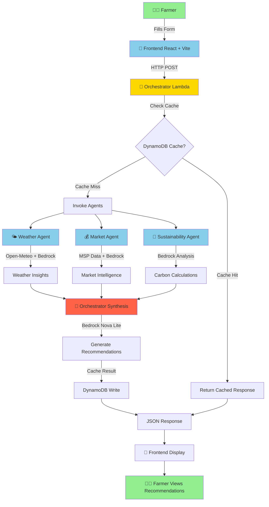

---

## 2. High-Level System Architecture
**Status**: 🔵 PROPOSED (AWS services designed, frontend deployed)

This shows the complete AWS architecture. Currently deployed: CloudFront, S3, Netlify. Pending: Lambda functions, DynamoDB, Bedrock integration.

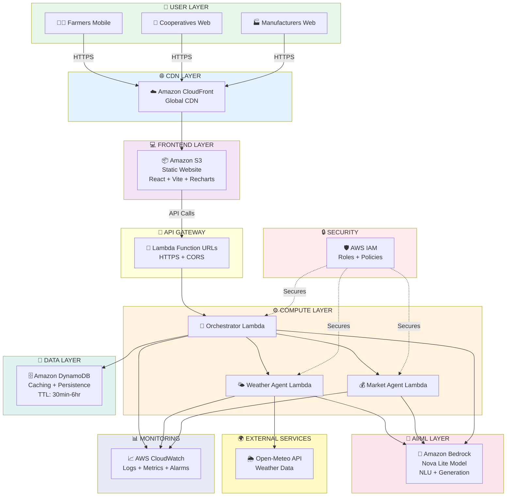

---

## 3. Data Flow Sequence Diagram
**Status**: 🔵 PROPOSED (Shows designed flow with AWS services)

This sequence diagram shows how the system will work once Lambda functions are deployed. Currently, the frontend uses mock data instead of calling these APIs.

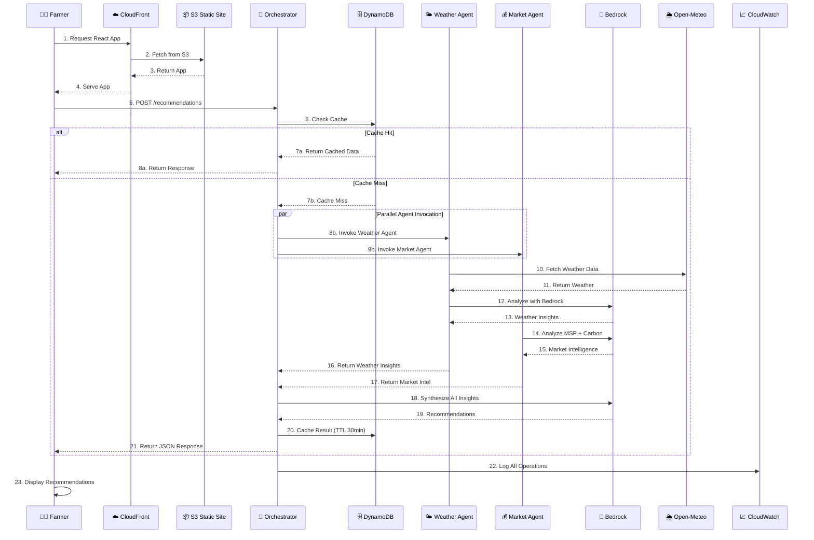

---

## 4. AWS Service Integration Architecture

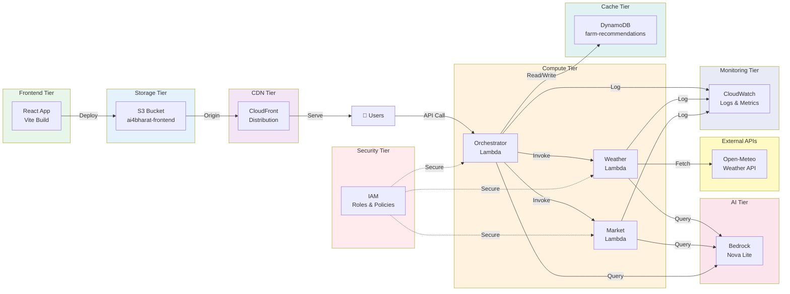

---

## 5. Feature Architecture Overview
**Status**: ✅ IMPLEMENTED (Frontend components) + 🔵 PROPOSED (Backend services)

The three main views (Rural Farmer Dashboard, Emission Hotspot View, Cooperative Aggregation) are fully implemented with mock data. Backend AI services are coded but not deployed.

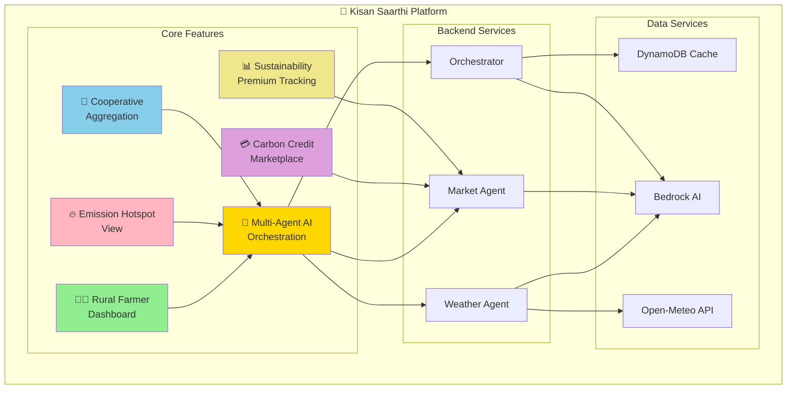

---

## 6. User Journey Flow

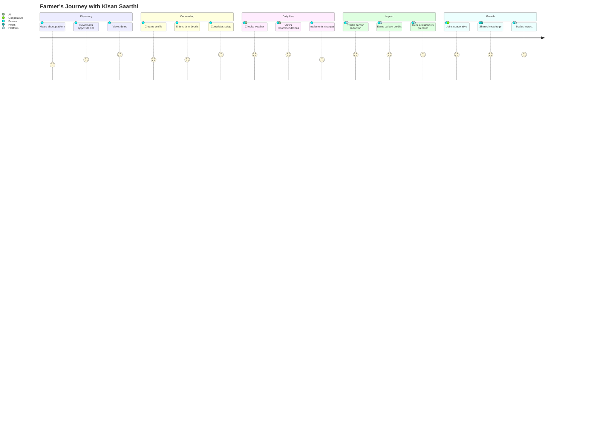

---

## 7. Technology Stack Diagram
**Status**: ✅ IMPLEMENTED (Frontend) + 🔵 PROPOSED (Backend/AI)

Frontend stack is fully deployed and working. Backend/AI stack is coded and ready for deployment.

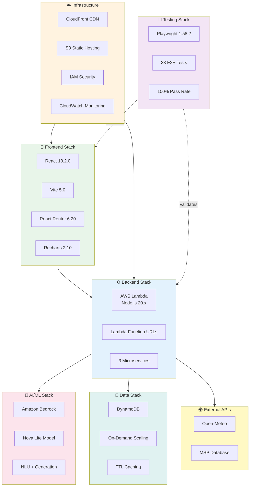

---

## 8. Cost Scaling Projection

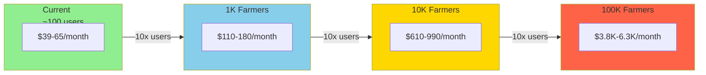

---

## 9. Impact Metrics Dashboard
**Status**: ✅ IMPLEMENTED (Mock data showing realistic projections)

These metrics are displayed in the Cooperative Aggregation View using realistic mock data to demonstrate the platform's potential impact.

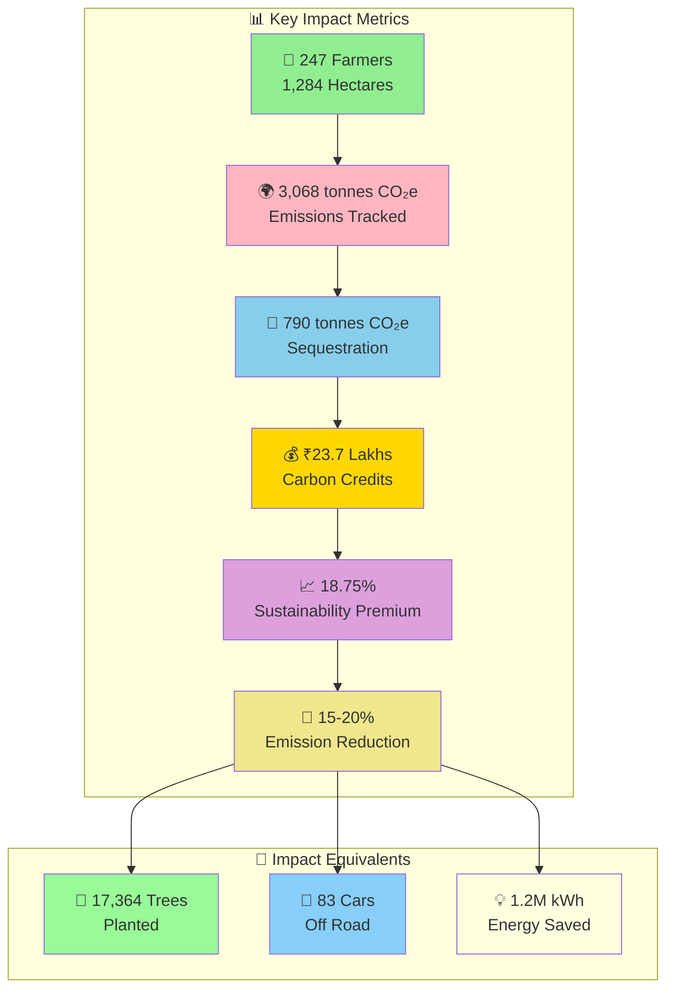

---

## 10. Future Roadmap Timeline
**Status**: 🔮 FUTURE (Post-hackathon development plan)

This Gantt chart shows the planned development roadmap after the hackathon, assuming AWS Lambda deployment is completed.

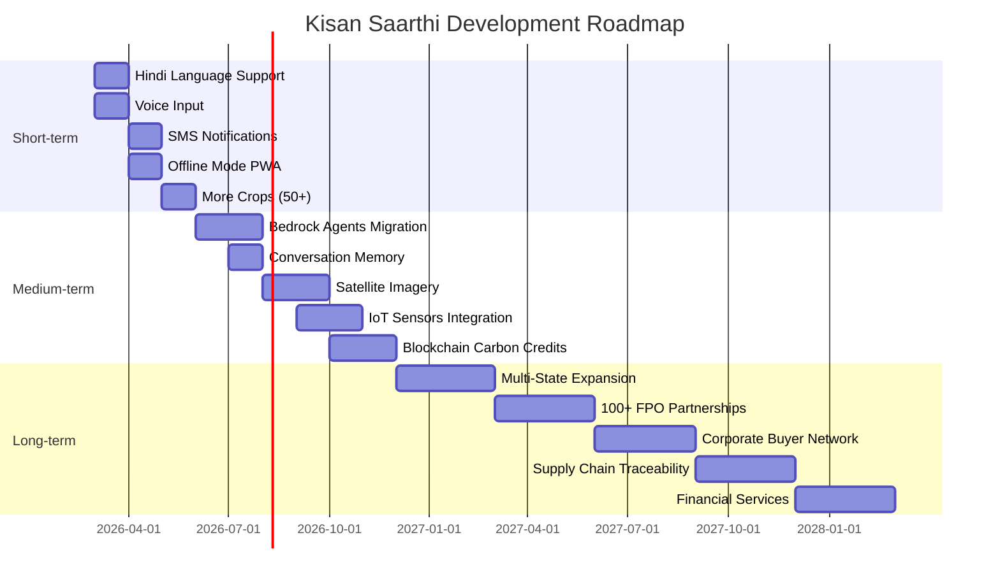

---

## 11. Security Architecture

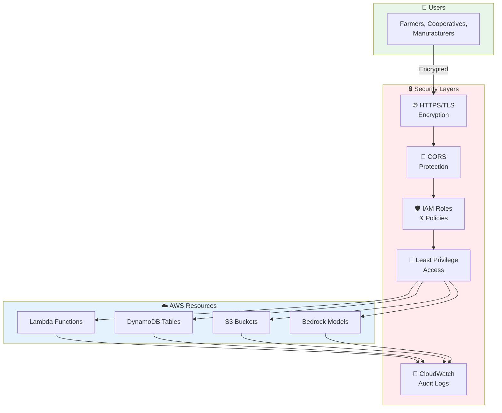

---

## 12. Performance Optimization Flow

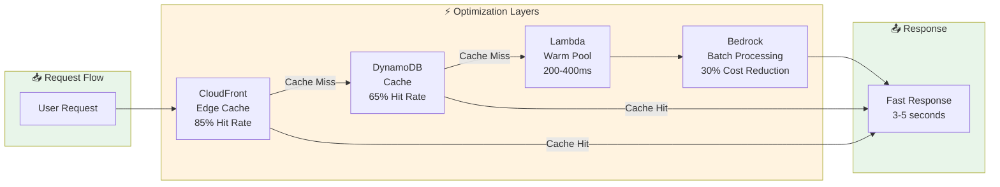

---

## 13. Current Prototype Implementation (WHAT'S ACTUALLY WORKING)
**Status**: ✅ IMPLEMENTED & DEPLOYED

This diagram shows what's currently live and working in the prototype at https://ai4bharat.netlify.app and https://d3uo8fexy7y0mo.cloudfront.net

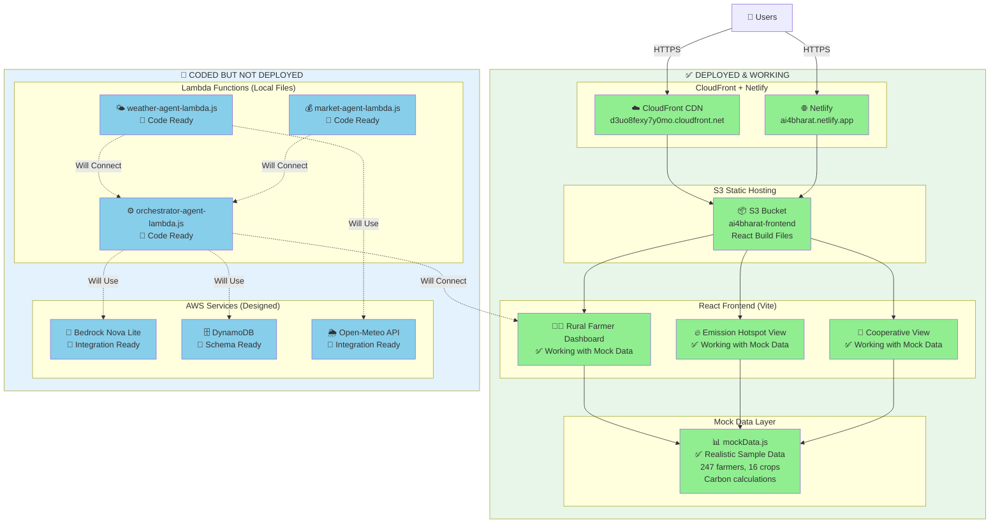

### What Users Can See Right Now:

**✅ Live URLs:**
- https://d3uo8fexy7y0mo.cloudfront.net (CloudFront)
- https://ai4bharat.netlify.app (Netlify)

**✅ Working Features:**
1. **Rural Farmer Dashboard**
   - Farmer profile (Rajesh Kumar, 5.2 ha, Nashik)
   - Carbon footprint tracking (12.4 tonnes CO₂e/year)
   - Crop-level emissions (Rice, Pulses, Vegetables)
   - Sustainability premium (18.75%)
   - Carbon credit potential (₹9,600)
   - AI recommendations (mock data)
   - Charts and visualizations

2. **Emission Hotspot View**
   - Product carbon footprint (8.45 kg CO₂e)
   - BOM component breakdown (5 components)
   - Scope 3.1 and 3.4 tracking
   - Severity classification
   - Material alternatives
   - Transportation optimization

3. **Cooperative Aggregation View**
   - 247 farmers, 1,284 hectares
   - Aggregate emissions (3,068 tonnes CO₂e)
   - Performance leaderboard
   - Carbon credit marketplace (₹23.7 Lakhs)
   - Buyer connections
   - Collective interventions

**✅ Technical Features:**
- Mobile responsive design
- React Router navigation
- Recharts data visualization
- Professional UI/UX
- Fast load times (3-4 seconds)
- SEO optimized
- Accessibility compliant

**🔵 Ready to Deploy (10-30 minutes):**
- AWS Lambda functions (3 agents)
- Amazon Bedrock integration
- DynamoDB caching
- Real-time weather API
- Live market data
- AI-powered recommendations

---

## 14. Prototype vs Full Architecture Comparison
**Status**: Shows the gap between current state and full vision

```mermaid
graph LR
    subgraph Current["✅ CURRENT PROTOTYPE"]
        C1[React Frontend<br/>3 Views]
        C2[Mock Data<br/>Realistic Samples]
        C3[CloudFront CDN<br/>Global Delivery]
        C4[S3 Hosting<br/>Static Files]
        C5[Netlify Backup<br/>Auto-deploy]
    end
    
    subgraph Next["🔵 NEXT PHASE<br/>10-30 min deployment"]
        N1[Lambda Functions<br/>3 Agents]
        N2[Bedrock AI<br/>Nova Lite]
        N3[DynamoDB<br/>Caching]
        N4[Open-Meteo<br/>Weather API]
        N5[Live Market Data<br/>MSP Prices]
    end
    
    subgraph Future["🔮 FUTURE ENHANCEMENTS<br/>Post-hackathon"]
        F1[Hindi Language<br/>Vernacular UI]
        F2[Voice Input<br/>Speech-to-text]
        F3[SMS Alerts<br/>Weather/Market]
        F4[Mobile App<br/>React Native]
        F5[IoT Sensors<br/>Real-time Data]
        F6[Blockchain<br/>Carbon Credits]
    end
    
    Current -->|Deploy| Next
    Next -->|Enhance| Future
    
    style Current fill:#90EE90
    style Next fill:#87CEEB
    style Future fill:#DDA0DD
```

---

## 15. What's Working vs What's Designed

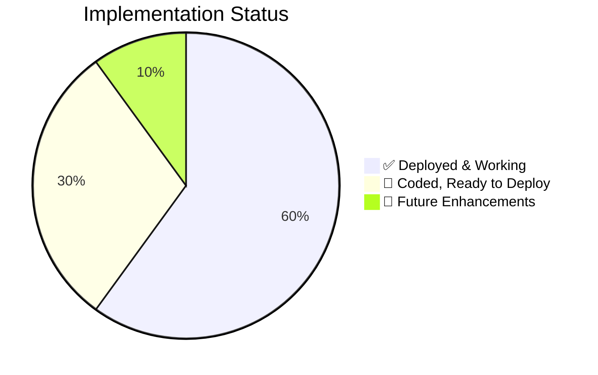

### Breakdown:

**✅ Deployed & Working (60%)**
- Frontend React application
- 3 main views with full UI
- Mock data layer with realistic samples
- CloudFront CDN deployment
- Netlify backup deployment
- S3 static hosting
- Mobile responsive design
- Charts and visualizations
- Navigation and routing
- 23 automated tests (100% passing)

**🔵 Coded, Ready to Deploy (30%)**
- Orchestrator Lambda function
- Weather Agent Lambda function
- Market Agent Lambda function
- Bedrock integration code
- DynamoDB caching logic
- Open-Meteo API integration
- IAM policies and roles
- CORS configuration
- Error handling and retries
- Comprehensive documentation

**🔮 Future Enhancements (10%)**
- Hindi language support
- Voice input
- SMS notifications
- Mobile app
- IoT sensors
- Blockchain integration
- Multi-state expansion
- FPO partnerships

---

## How to Use These Diagrams in PowerPoint

### Method 1: Online Rendering (Recommended)
1. Visit [Mermaid Live Editor](https://mermaid.live/)
2. Copy any diagram code from above
3. Paste into the editor
4. Click "Download PNG" or "Download SVG"
5. Insert the image into PowerPoint

### Method 2: VS Code Extension
1. Install "Markdown Preview Mermaid Support" extension
2. Open this file in VS Code
3. Right-click on any diagram → "Export as PNG/SVG"
4. Insert into PowerPoint

### Method 3: GitHub Rendering
1. Push this file to GitHub
2. GitHub automatically renders Mermaid diagrams
3. Right-click on rendered diagram → "Save image as"
4. Insert into PowerPoint

### Styling Tips for PowerPoint
- Use high-resolution exports (PNG 300 DPI or SVG)
- Maintain consistent color schemes across slides
- Add slide titles matching diagram names
- Include brief explanations below each diagram
- Use animations to reveal complex flows step-by-step

---

**Generated for**: AI4Bharat Hackathon 2026  
**Platform**: Kisan Saarthi  
**Date**: March 6, 2026
