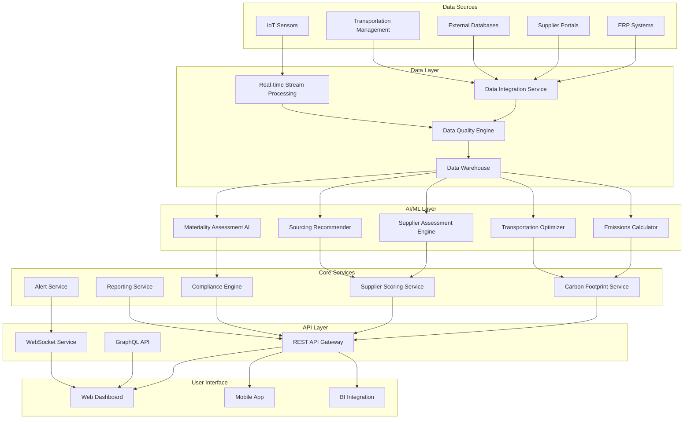

# Design Document: AI-Powered Supply Chain Sustainability and Emissions Tracking

## Overview

The AI-powered supply chain sustainability and emissions tracking solution is a comprehensive platform that leverages machine learning, data integration, and advanced analytics to monitor, assess, and optimize environmental impact across complex multi-tier supply chains. The system provides real-time carbon footprint monitoring, supplier sustainability assessment, transportation optimization, and regulatory compliance management.

The platform follows a microservices architecture with AI/ML components for predictive analytics, optimization algorithms, and automated decision-making. It integrates with existing enterprise systems (ERP, procurement, logistics) while providing specialized sustainability analytics and reporting capabilities.

## Architecture

### System Architecture



### Component Architecture

**Data Integration Layer:**
- Multi-protocol data connectors (REST, SOAP, FTP, EDI)
- Real-time streaming for IoT and sensor data
- Batch processing for periodic data updates
- Data transformation and normalization pipelines

**AI/ML Processing Layer:**
- Emissions calculation engine with standardized emission factors
- Machine learning models for supplier risk assessment
- Optimization algorithms for transportation and logistics
- Natural language processing for sustainability report analysis
- Predictive models for supply chain risk and performance

**Business Logic Layer:**
- Carbon footprint aggregation and analysis
- Supplier sustainability scoring and ranking
- Compliance monitoring and reporting
- Alert and notification management
- Audit trail and data lineage tracking

## Components and Interfaces

### Emissions Calculator Service

**Purpose:** Calculates carbon footprints across supply chain tiers using standardized methodologies and emission factors.

**Key Interfaces:**
```typescript
interface EmissionsCalculator {
  calculateTierEmissions(tierData: SupplyChainTier, emissionFactors: EmissionFactors): EmissionResult
  aggregateScope3Emissions(supplierEmissions: EmissionResult[]): Scope3Summary
  updateEmissionFactors(factors: EmissionFactors): void
  validateCalculationInputs(data: ActivityData): ValidationResult
}

interface EmissionResult {
  totalEmissions: number
  emissionsByCategory: Map<string, number>
  confidenceLevel: number
  calculationMethod: string
  timestamp: Date
}
```

### Supplier Assessment Engine

**Purpose:** Evaluates supplier sustainability performance using multi-dimensional scoring algorithms.

**Key Interfaces:**
```typescript
interface SupplierAssessment {
  assessSupplier(supplierData: SupplierProfile): SustainabilityScore
  rankSuppliers(suppliers: SupplierProfile[]): RankedSupplierList
  identifyImprovementAreas(supplier: SupplierProfile): ImprovementPlan
  trackPerformanceTrends(supplierId: string, timeRange: DateRange): PerformanceTrend
}

interface SustainabilityScore {
  overallScore: number
  environmentalScore: number
  socialScore: number
  governanceScore: number
  carbonIntensity: number
  riskLevel: RiskLevel
}
```

### Transportation Optimizer

**Purpose:** Optimizes transportation routes and logistics to minimize emissions while meeting operational constraints.

**Key Interfaces:**
```typescript
interface TransportationOptimizer {
  optimizeRoute(request: TransportationRequest): OptimizationResult
  evaluateMultiModal(options: TransportationMode[]): MultiModalAnalysis
  predictEmissions(route: Route, mode: TransportationMode): EmissionPrediction
  learnFromExecution(planned: Route, actual: ExecutionData): void
}

interface OptimizationResult {
  recommendedRoute: Route
  alternativeRoutes: Route[]
  emissionReduction: number
  costImpact: number
  deliveryTimeImpact: number
}
```

### Compliance Engine

**Purpose:** Manages regulatory compliance across multiple frameworks including GRI, CDP, TCFD, and CSRD.

**Key Interfaces:**
```typescript
interface ComplianceEngine {
  assessCompliance(framework: ComplianceFramework): ComplianceStatus
  generateReport(framework: ComplianceFramework, data: SustainabilityData): ComplianceReport
  validateDataCompleteness(requirements: DataRequirements): ValidationResult
  trackRegulatory Changes(jurisdiction: string): RegulatoryUpdate[]
}

interface ComplianceStatus {
  framework: ComplianceFramework
  completionPercentage: number
  missingDataPoints: string[]
  riskLevel: RiskLevel
  nextDeadline: Date
}
```

### Materiality Assessment AI

**Purpose:** Conducts AI-powered materiality assessments to identify most significant sustainability topics.

**Key Interfaces:**
```typescript
interface MaterialityAssessment {
  conductAssessment(organizationProfile: OrganizationProfile): MaterialityMatrix
  analyzeStakeholderInput(feedback: StakeholderFeedback[]): StakeholderAnalysis
  identifyMaterialTopics(assessment: MaterialityMatrix): MaterialTopic[]
  updateAssessment(newData: SustainabilityData): MaterialityMatrix
}

interface MaterialityMatrix {
  topics: MaterialTopic[]
  stakeholderImportance: Map<string, number>
  businessImpact: Map<string, number>
  priorityRanking: string[]
}
```

## Data Models

### Core Data Structures

**Supply Chain Tier:**
```typescript
interface SupplyChainTier {
  tierId: string
  tierLevel: number // 1, 2, 3, etc.
  suppliers: Supplier[]
  products: Product[]
  geographicRegions: Region[]
  totalSpend: number
  riskLevel: RiskLevel
}

interface Supplier {
  supplierId: string
  name: string
  location: Location
  sustainabilityScore: SustainabilityScore
  certifications: Certification[]
  emissionData: EmissionData
  assessmentHistory: Assessment[]
}
```

**Emission Data:**
```typescript
interface EmissionData {
  scope1Emissions: number
  scope2Emissions: number
  scope3Emissions: Scope3Breakdown
  emissionIntensity: number
  calculationMethod: string
  dataQuality: DataQuality
  reportingPeriod: DateRange
}

interface Scope3Breakdown {
  purchasedGoods: number
  transportation: number
  wasteGenerated: number
  businessTravel: number
  employeeCommuting: number
  upstreamAssets: number
  downstreamTransportation: number
  processingOfProducts: number
  useOfProducts: number
  endOfLifeTreatment: number
}
```

**Transportation Data:**
```typescript
interface TransportationRequest {
  origin: Location
  destination: Location
  cargo: CargoDetails
  constraints: TransportationConstraints
  preferences: OptimizationPreferences
}

interface Route {
  segments: RouteSegment[]
  totalDistance: number
  estimatedEmissions: number
  estimatedCost: number
  estimatedTime: number
  transportationModes: TransportationMode[]
}
```

**GRI Reporting Data:**
```typescript
interface GRIReport {
  reportingPeriod: DateRange
  organizationProfile: OrganizationProfile
  materialTopics: MaterialTopic[]
  universalStandards: UniversalStandardDisclosures
  topicStandards: TopicStandardDisclosures
  stakeholderEngagement: StakeholderEngagementData
  assuranceStatement: AssuranceStatement
}

interface MaterialTopic {
  topicId: string
  topicName: string
  description: string
  stakeholderImportance: number
  businessImpact: number
  managementApproach: ManagementApproach
  disclosures: Disclosure[]
}
```

### Data Quality and Validation

**Data Quality Framework:**
```typescript
interface DataQuality {
  completeness: number // 0-1
  accuracy: number // 0-1
  timeliness: number // 0-1
  consistency: number // 0-1
  validity: number // 0-1
  overallScore: number // 0-1
  qualityFlags: QualityFlag[]
}

interface ValidationRule {
  ruleId: string
  description: string
  validationLogic: ValidationFunction
  severity: ValidationSeverity
  applicableDataTypes: string[]
}
```

## Correctness Properties

*A property is a characteristic or behavior that should hold true across all valid executions of a system—essentially, a formal statement about what the system should do. Properties serve as the bridge between human-readable specifications and machine-verifiable correctness guarantees.*

### Property 1: Emissions Calculation Accuracy
*For any* valid supply chain activity data and standardized emission factors, the calculated carbon footprint should be mathematically consistent with the emission factor methodology and aggregation rules across all tiers.
**Validates: Requirements 1.1, 1.2, 4.4**

### Property 2: Calculation Update Consistency  
*For any* emission factor update, all affected carbon footprint calculations should be automatically recalculated and the results should reflect the new factors consistently across the entire system.
**Validates: Requirements 1.3**

### Property 3: Historical Data Persistence
*For any* carbon footprint calculation, the historical data should be retrievable with the same values and metadata as when it was originally stored.
**Validates: Requirements 1.4**

### Property 4: Threshold Alert Generation
*For any* carbon footprint measurement that exceeds configured thresholds, appropriate alerts should be generated and delivered to designated stakeholders according to the alert configuration.
**Validates: Requirements 1.5, 3.5, 6.4**

### Property 5: Scope 3 Emissions Completeness
*For any* emissions tracking request, all 15 scope 3 categories defined by the GHG Protocol should be tracked and none should be omitted from the comprehensive assessment.
**Validates: Requirements 2.1**

### Property 6: Regulatory Report Format Compliance
*For any* sustainability data and specified regulatory framework (CDP, TCFD, CSRD, GRI), the generated report should contain all required fields and follow the correct format specifications for that framework.
**Validates: Requirements 2.2, 6.5, 9.4, 9.5**

### Property 7: Data Quality Validation
*For any* ingested emissions or sustainability data, the system should validate data quality using predefined rules and flag inconsistencies, missing information, or quality issues appropriately.
**Validates: Requirements 2.3, 7.2, 7.3**

### Property 8: Audit Trail Completeness
*For any* emissions calculation, sustainability assessment, or compliance report, complete audit trails should be maintained including data sources, calculation methods, and processing timestamps.
**Validates: Requirements 2.4, 6.6, 7.5**

### Property 9: Report Generation Mode Equivalence
*For any* sustainability data, reports generated through automated periodic processing and on-demand generation should produce equivalent results when using the same data and timeframe.
**Validates: Requirements 2.6**

### Property 10: Supplier Assessment Consistency
*For any* supplier data with identical environmental, social, and governance metrics, the calculated sustainability scores should be identical regardless of when or how the assessment is performed.
**Validates: Requirements 3.1, 3.2, 3.3**

### Property 11: Supplier Ranking Mathematical Correctness
*For any* set of suppliers with sustainability scores, the ranking should be mathematically consistent with the scoring methodology and properly ordered from highest to lowest performance.
**Validates: Requirements 3.3**

### Property 12: Performance Trend Detection Accuracy
*For any* supplier with historical sustainability data, detected trends should accurately reflect the mathematical direction and magnitude of performance changes over time.
**Validates: Requirements 3.4**

### Property 13: Assessment Mode Consistency
*For any* supplier data that can be assessed both automatically and manually, the overlapping assessment components should produce consistent results between the two modes.
**Validates: Requirements 3.6**

### Property 14: Transportation Optimization Effectiveness
*For any* transportation request, the recommended route should have lower or equal carbon emissions compared to alternative routes while meeting all specified constraints.
**Validates: Requirements 4.1, 4.3**

### Property 15: Multi-Modal Transportation Consideration
*For any* transportation optimization request, all available and applicable transportation modes should be evaluated and considered in the optimization process.
**Validates: Requirements 4.2**

### Property 16: Transportation Performance Tracking Accuracy
*For any* executed transportation plan, the actual versus predicted emissions performance tracking should accurately record and compare the planned and actual values.
**Validates: Requirements 4.5**

### Property 17: Sustainable Sourcing Recommendation Quality
*For any* sourcing requirements, recommended suppliers should have demonstrably superior sustainability performance compared to non-recommended alternatives in the same category.
**Validates: Requirements 5.1, 5.2**

### Property 18: Lifecycle Impact Assessment Completeness
*For any* sourcing evaluation, all lifecycle stages (production, transportation, end-of-life) should be included in the environmental impact assessment.
**Validates: Requirements 5.3**

### Property 19: Trade-off Analysis Mathematical Accuracy
*For any* sourcing options, the trade-off analysis between sustainability, cost, quality, and delivery factors should be mathematically accurate and reflect the actual performance differences.
**Validates: Requirements 5.4, 5.5**

### Property 20: Dynamic Recommendation Updates
*For any* sourcing recommendation, when underlying supplier data or market conditions change, the recommendations should update appropriately to reflect the new information.
**Validates: Requirements 5.6**

### Property 21: Regulatory Framework Update Propagation
*For any* regulatory requirement update, all affected compliance frameworks and assessment criteria should be updated consistently across the system.
**Validates: Requirements 6.1**

### Property 22: Compliance Gap Analysis Accuracy
*For any* compliance assessment, identified gaps should accurately reflect missing or insufficient data relative to the regulatory requirements, and generated recommendations should address the specific gaps.
**Validates: Requirements 6.2**

### Property 23: Regulatory Data Validation Correctness
*For any* collected sustainability data, validation against regulatory requirements should correctly identify completeness, accuracy, and timeliness issues according to the specific regulatory standards.
**Validates: Requirements 6.3**

### Property 24: Data Integration Source Completeness
*For any* data integration process, data from all configured source types (ERP, supplier portals, IoT sensors, third-party databases) should be successfully integrated without loss or corruption.
**Validates: Requirements 7.1**

### Property 25: Data Inconsistency Resolution
*For any* detected data inconsistency, appropriate reconciliation workflows should be triggered and audit capabilities should be available to track the resolution process.
**Validates: Requirements 7.4**

### Property 26: Processing Mode Result Consistency
*For any* sustainability data that can be processed in both real-time and batch modes, the processing results should be mathematically equivalent regardless of the processing mode used.
**Validates: Requirements 7.6**

### Property 27: AI Recommendation Explainability Completeness
*For any* AI-generated recommendation, the explanation should include all key factors and decision logic components that contributed to the recommendation.
**Validates: Requirements 8.1**

### Property 28: AI Prediction Uncertainty Quantification
*For any* AI model prediction, confidence intervals and uncertainty measures should be included and should accurately reflect the model's confidence in the prediction.
**Validates: Requirements 8.2**

### Property 29: Model Performance Monitoring Accuracy
*For any* AI model in production, performance metrics should be accurately tracked and model drift or degradation should be detected when performance falls below acceptable thresholds.
**Validates: Requirements 8.3**

### Property 30: Model Version Control Integrity
*For any* model retraining event, version control should maintain complete model history and rollback functionality should restore previous model versions with identical behavior.
**Validates: Requirements 8.4**

### Property 31: Model Analysis Result Validity
*For any* sustainability model, feature importance analysis and sensitivity testing should produce meaningful and interpretable results that accurately reflect the model's decision-making process.
**Validates: Requirements 8.5**

### Property 32: A/B Testing Framework Validity
*For any* A/B test of model approaches or recommendation strategies, the testing framework should produce statistically valid comparisons and unbiased results.
**Validates: Requirements 8.6**

### Property 33: Materiality Assessment Topic Identification
*For any* organizational profile and stakeholder input, the materiality assessment should identify sustainability topics that are genuinely relevant to both the organization's impact and stakeholder concerns.
**Validates: Requirements 9.1, 9.2**

### Property 34: GRI Standards Data Organization Compliance
*For any* sustainability data collection and organization process, the structure and content should comply with GRI Universal Standards, Sector Standards, and Topic Standards requirements.
**Validates: Requirements 9.3**

### Property 35: Human Rights Assessment Value Chain Coverage
*For any* human rights impact assessment, the evaluation should comprehensively cover the entire value chain and meet all disclosure requirements for human rights impacts.
**Validates: Requirements 9.6**

### Property 36: GRI Assurance Process Support
*For any* GRI reporting request, the system should provide complete support for independent assurance processes and transparent methodology documentation that meets assurance standards.
**Validates: Requirements 9.7**

## Error Handling

### Data Quality Error Handling
- **Invalid Emission Factors**: System validates emission factors against acceptable ranges and scientific standards
- **Missing Supply Chain Data**: Implements interpolation algorithms and flags data gaps for manual review
- **Inconsistent Supplier Information**: Provides data reconciliation workflows with audit trails
- **Calculation Errors**: Implements validation checks and fallback calculation methods

### Integration Error Handling
- **API Failures**: Implements retry mechanisms with exponential backoff and circuit breaker patterns
- **Data Format Mismatches**: Provides data transformation pipelines with error logging
- **Network Connectivity Issues**: Implements offline mode with data synchronization when connectivity is restored
- **Authentication Failures**: Provides secure token refresh and re-authentication workflows

### AI/ML Error Handling
- **Model Prediction Failures**: Implements fallback to previous model versions or rule-based alternatives
- **Training Data Quality Issues**: Provides data validation and cleaning pipelines before model training
- **Model Drift Detection**: Implements automated retraining triggers and performance monitoring
- **Explainability Failures**: Provides alternative explanation methods and transparency reports

### Compliance Error Handling
- **Regulatory Update Failures**: Implements manual override capabilities and expert review workflows
- **Report Generation Errors**: Provides detailed error logging and partial report recovery
- **Deadline Management Failures**: Implements escalation procedures and manual notification systems
- **Audit Trail Corruption**: Provides backup audit systems and data recovery procedures

## Testing Strategy

### Dual Testing Approach

The system requires both unit testing and property-based testing to ensure comprehensive coverage:

**Unit Tests:**
- Specific examples of emissions calculations with known inputs and expected outputs
- Edge cases for data quality validation (empty data, extreme values, malformed inputs)
- Integration points between AI/ML components and business logic
- Error conditions and exception handling scenarios
- Specific regulatory compliance scenarios with known requirements

**Property-Based Tests:**
- Universal properties that hold across all valid inputs using randomized test data
- Comprehensive input coverage through automated test case generation
- Validation of mathematical relationships and business rules
- Cross-component consistency verification
- Performance characteristics under varying load conditions

### Property-Based Testing Configuration

**Testing Framework:** Use Hypothesis (Python), fast-check (TypeScript), or QuickCheck (Haskell) depending on implementation language
**Test Configuration:**
- Minimum 100 iterations per property test to ensure statistical confidence
- Each property test references its corresponding design document property
- Tag format: **Feature: supply-chain-sustainability, Property {number}: {property_text}**

**Example Property Test Structure:**
```python
@given(supply_chain_data=supply_chain_strategy(), emission_factors=emission_factors_strategy())
def test_emissions_calculation_accuracy(supply_chain_data, emission_factors):
    """Feature: supply-chain-sustainability, Property 1: Emissions Calculation Accuracy"""
    result = emissions_calculator.calculate_tier_emissions(supply_chain_data, emission_factors)
    assert result.total_emissions >= 0
    assert result.calculation_method in VALID_METHODS
    assert len(result.emissions_by_category) > 0
```

### Integration Testing Strategy

**End-to-End Scenarios:**
- Complete supply chain assessment workflow from data ingestion to report generation
- Multi-tier supplier evaluation and scoring processes
- Transportation optimization with real-world constraint scenarios
- Regulatory compliance reporting across multiple frameworks simultaneously

**Performance Testing:**
- Load testing with realistic supply chain data volumes
- Stress testing of AI/ML model inference under high request volumes
- Scalability testing for multi-tenant deployment scenarios
- Response time validation for real-time optimization requests

**Security Testing:**
- Data privacy and protection validation for sensitive supply chain information
- Authentication and authorization testing for multi-role access scenarios
- API security testing including input validation and injection prevention
- Audit trail integrity and tamper detection validation