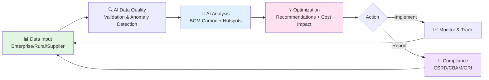
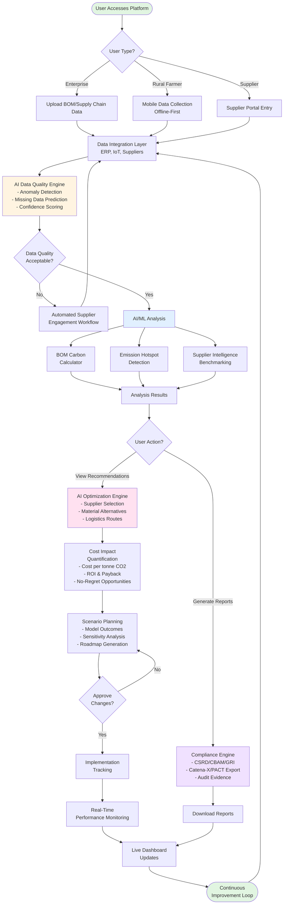
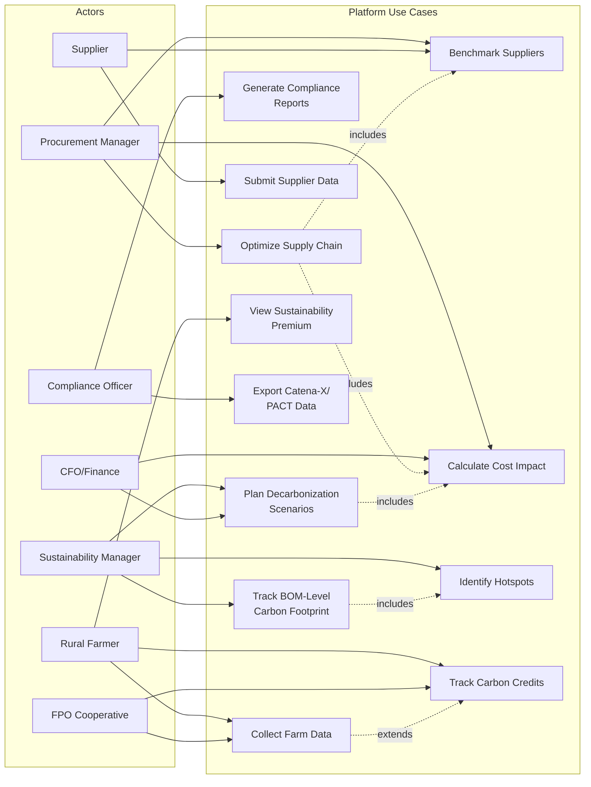
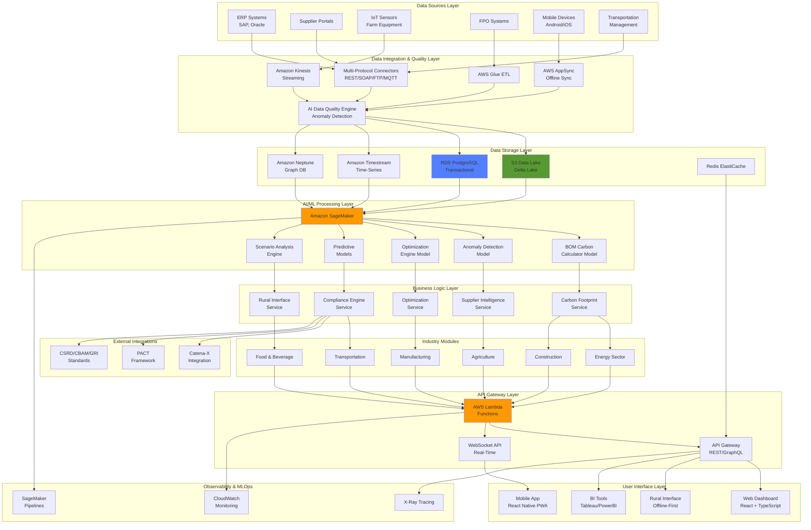

# AI for Bharat Hackathon - Idea Submission (Updated Jan 28, 2026)

**Team Name:** VIPERS  
**Team Leader Name:** Sanjay Chari  
**Problem Statement:** Build an AI-powered solution that supports rural ecosystems, sustainability, or resource-efficient systems.

---

## Brief about the Idea

An AI-powered supply chain decarbonization platform that moves **"beyond reporting to real-world reductions"** - focusing on actionable decarbonization rather than just carbon accounting. The system delivers BOM-level carbon visibility, supplier intelligence with side-by-side benchmarking, AI-driven optimization recommendations, and multi-framework regulatory compliance across multi-tier supply chains:

- **CSRD** - Corporate Sustainability Reporting Directive (EU mandatory sustainability disclosure)
- **CBAM** - Carbon Border Adjustment Mechanism (EU carbon pricing on imports)
- **GRI** - Global Reporting Initiative (international sustainability reporting standards)
- **Catena-X** - Automotive industry data ecosystem for supply chain transparency
- **PACT** - Partnership for Carbon Transparency (product carbon footprint data exchange)

The platform specifically targets the **top GHG (Greenhouse Gas)-emitting sectors** (Energy 25-34%, Agriculture 18-24%, Manufacturing 21-25%, Transportation 14-16%) while maintaining accessibility for **rural ecosystems, agricultural supply chains, and Farmer Producer Organizations (FPOs)**.

---

## How Will It Be Able to Solve the Problem?

The platform solves the rural sustainability and supply chain decarbonization problem through five integrated mechanisms:

### 1. **Visibility Gap → BOM-Level Carbon Intelligence**
**Problem**: Organizations don't know where emissions occur in their supply chains, especially in rural/agricultural tiers  
**Solution**: 
- AI-powered BOM-level carbon footprint analysis traces emissions to specific components, materials, and suppliers
- Automatic identification of 100% of emission hotspots with severity classification (critical/high/medium/low)
- Real-time Scope 3.1 (Purchased Goods) and 3.4 (Transportation) visibility across all tiers
- Farm-level carbon footprinting for agricultural products including crops, livestock, and inputs

### 2. **Information Asymmetry → Accessible Rural Interfaces**
**Problem**: Rural farmers and cooperatives lack access to sustainability tools and market information  
**Solution**:
- Offline-first mobile data collection works in low-connectivity rural areas
- Vernacular language support (Hindi + regional languages) for accessibility
- Simple interfaces designed for smallholder farmers with limited technical literacy
- FPO and cooperative integration for aggregated reporting and collective bargaining power
- Sustainability premium and carbon credit visibility showing financial benefits of sustainable practices

### 3. **Inaction Due to Uncertainty → AI-Driven Actionable Recommendations**
**Problem**: Organizations have carbon data but don't know what actions to take or their cost/benefit  
**Solution**:
- Context-aware AI recommendations for supplier selection, material alternatives, and logistics optimization
- Cost impact quantification: cost per tonne of CO2 reduced, total cost of ownership, ROI with payback periods
- "No-regret" opportunity flagging where carbon reduction and cost savings align (targeting 5-10% cost savings)
- Implementation roadmaps with milestones, KPIs, and dependency mapping
- Scenario planning tools to model outcomes before committing resources

### 4. **Data Quality Issues → AI-Powered Data Management**
**Problem**: Missing or unreliable supplier emissions data prevents accurate assessment  
**Solution**:
- Anomaly detection algorithms automatically flag missing or suspicious data with confidence scores
- Predictive modeling fills data gaps using similar suppliers and historical patterns
- Automated supplier engagement workflows to improve data submission rates
- Target 20% improvement in data accuracy through automated validation
- Learning algorithms that improve from corrected data over time

### 5. **Compliance Complexity → Multi-Framework Automation**
**Problem**: Multiple overlapping regulations (EU, industry-specific, customer requirements) create compliance burden  
**Solution**:
- Automated report generation for CSRD, CBAM, GRI, CDP, TCFD, SBTi, NHS compliance
- Catena-X and PACT format export for supply chain data exchange
- Audit-ready evidence packages with complete data lineage and traceability
- Automatic updates when regulatory frameworks change
- Industry-specific compliance modules (automotive, medical devices, food & beverage, etc.)

### Impact Path for Rural Ecosystems

```
Rural Farmers                        Supply Chain Actors                      Impact
     │                                       │                                  │
     ├─► Farm-level carbon data      ───►   ├─► Supplier visibility     ───►  ├─► Market access
     │   (mobile, vernacular)                │   (BOM-level tracking)          │   (sustainable sourcing)
     │                                       │                                  │
     ├─► FPO aggregation             ───►   ├─► Benchmarking              ───► ├─► Fair pricing
     │   (cooperative reporting)             │   (performance scoring)          │   (sustainability premium)
     │                                       │                                  │
     ├─► Regenerative practices      ───►   ├─► Carbon credits            ───► ├─► Additional income
     │   (soil carbon tracking)              │   (verified reductions)          │   (climate finance)
     │                                       │                                  │
     └─► Compliance documentation    ───►   └─► Certified supply          ───► └─► Long-term partnerships
         (certification support)                 (audit-ready evidence)             (stable demand)
```

### Measurable Problem-Solving Outcomes

| Problem | Solution Mechanism | Target Impact |
|---------|-------------------|---------------|
| **Hidden emissions in supply chains** | BOM-level hotspot detection | 100% of emission hotspots identified |
| **High Scope 3 emissions** | Supplier + logistics optimization | 15-20% Scope 3 emission reductions |
| **Cost-sustainability trade-off** | Integrated cost-carbon analysis | 5-10% cost savings uncovered |
| **Poor data quality** | AI validation and prediction | 20% improvement in data accuracy |
| **Rural exclusion from green markets** | Accessible interfaces + FPO integration | Connect smallholders to sustainable supply chains |
| **Compliance burden** | Multi-framework automation | Reduce reporting time by 60-80% |

### Scalability & Practical Innovation

**Local to Global**: Starts with individual farms/suppliers, aggregates to cooperatives, scales to multinational supply chains

**Multi-Industry**: 6 industry-specific modules cover 70%+ of global GHG emissions (Energy, Agriculture, Manufacturing, Transportation, Food & Beverage, Construction)

**Technology Inclusion**: Progressive feature unlocking - simple mobile interfaces for farmers → advanced AI analytics for enterprises

**Societal Value**: Creates transparency, fair pricing, and market access for rural producers while helping enterprises meet climate commitments

---

## Differentiation

| Feature | Our Platform | Traditional Solutions |
|---------|--------------|----------------------|
| **Carbon Analysis Depth** | BOM-level granularity with hierarchical aggregation | Aggregate company/facility level only |
| **Scope 3 Focus** | Deep Scope 3.1 (Purchased Goods) and 3.4 (Transport) visibility | Limited Scope 3 coverage |
| **Actionable Outputs** | AI recommendations with cost-per-tonne-CO2 and ROI projections | Reports without action guidance |
| **Rural Accessibility** | Offline-first mobile interfaces, vernacular language support, FPO integration | Enterprise-only, English-only |
| **Industry Coverage** | 6 sector-specific modules (Energy, Agriculture, Manufacturing, Transportation, Food & Beverage, Construction) | Generic or single-industry |
| **Compliance Breadth** | CSRD, CBAM, GRI, CDP, TCFD, Catena-X, PACT, SBTi, NHS | Single framework focus |
| **Cost-Carbon Integration** | Simultaneous cost and carbon optimization with "no-regret" opportunity flagging | Separate carbon and cost analysis |

---

## Solution Approach

### Phase 1: Data Integration & Quality
- **Multi-source ingestion**: ERP, supplier portals, IoT sensors, farm equipment, FPO systems
- **AI-powered data quality**: Anomaly detection, missing data prediction, 20% accuracy improvement target
- **Offline-first mobile collection**: Rural and low-connectivity data capture with sync capabilities

### Phase 2: AI-Driven Analysis
- **BOM Carbon Calculator**: Hierarchical emission calculation at component and material level
- **Hotspot Detection**: Automatic identification of 100% emission hotspots with severity classification
- **Predictive Modeling**: Confidence-scored estimates for missing data, trend forecasting
- **Supplier Intelligence**: Multi-dimensional scoring (carbon, cost, quality, delivery, certifications)

### Phase 3: Optimization & Action
- **Optimization Engine**: Context-aware recommendations for supplier selection, material substitution, logistics
- **Cost Impact Quantification**: Total cost of ownership, cost-per-tonne-CO2, ROI with payback periods
- **Scenario Planning**: Decarbonization pathway modeling with sensitivity analysis
- **"No-Regret" Flagging**: Opportunities where carbon reduction and cost savings align

### Phase 4: Compliance & Reporting
- **Multi-framework compliance**: CSRD, CBAM, GRI, CDP, TCFD with audit-ready evidence packages
- **Interoperability**: Catena-X and PACT JSON export for supply chain data exchange
- **Industry-specific modules**: NHS compliance for medical devices, EU taxonomy alignment
- **Rural reporting**: Cooperative-level aggregation, sustainability premium tracking

---

## USP (Unique Selling Proposition) - Brief Key Points

✓ **Beyond Reporting to Real Reductions** - AI-driven recommendations with ROI, not just carbon reports

✓ **BOM-Level Granularity** - Trace emissions to specific components, materials, and suppliers (not just facility-level)

✓ **Cost-Carbon Integration** - Every recommendation shows cost per tonne CO2 + payback period + "no-regret" opportunities

✓ **Rural-to-Enterprise Scale** - Same platform serves smallholder farmers (offline mobile, vernacular) and multinationals (Catena-X, PACT)

✓ **Multi-Industry Coverage** - 6 sector modules for Energy, Agriculture, Manufacturing, Transportation, Food, Construction (70%+ of global GHGs)

✓ **Multi-Framework Compliance** - One platform generates CSRD, CBAM, GRI, CDP, TCFD, Catena-X, PACT, SBTi, NHS reports

✓ **Proven Impact Metrics** - 15-20% emission reductions, 5-10% cost savings, 100% hotspot detection, 20% data accuracy improvement

---

### Detailed USP Breakdown

1. **BOM-Level Scope 3 Visibility** with explainable AI that traces emissions to specific components, materials, and suppliers

2. **Unified Decision Platform** combining:
   - Supplier intelligence and benchmarking
   - Material alternative recommendations
   - Logistics optimization
   - Compliance reporting
   - Cost impact analysis

3. **Quantified Actionable Outputs**:
   - Cost per tonne of CO2 reduced
   - ROI projections with payback periods
   - "No-regret" opportunity identification
   - Implementation roadmaps with milestones

4. **Rural Ecosystem Accessibility**:
   - Offline-first mobile interfaces
   - Vernacular language support
   - FPO and cooperative integration
   - Farm-level carbon footprinting
   - Sustainability premium and carbon credit tracking

5. **Industry-Specific Configurations** for the top GHG-emitting sectors with tailored emission sources, compliance requirements, and optimization opportunities

---

## Key Features

### Core Platform Capabilities
- **BOM-level carbon footprint analysis** with hierarchical emission aggregation
- **Scope 3.1 and 3.4 emissions visibility** with real-time supplier and geography tracking
- **AI-powered anomaly detection** with confidence scores and severity classification
- **Side-by-side supplier comparison** on carbon, cost, quality, and delivery dimensions
- **Material alternative benchmarking** with lifecycle impact analysis
- **Multi-modal logistics optimization** balancing emissions, cost, and delivery time
- **Scenario planning tools** for decarbonization pathway modeling
- **Cost impact quantification** with ROI and payback period calculations

### Compliance & Reporting
- **CSRD, CBAM, GRI, CDP, TCFD** compliant report generation
- **Catena-X and PACT format** data export for supply chain interoperability
- **SBTi progress tracking** for science-based targets
- **NHS compliance** for medical device manufacturers
- **Audit-ready evidence packages** with complete data lineage

### Rural & Agriculture Features
- **Farm-level carbon footprinting** for crops, livestock, and inputs
- **FPO and cooperative integration** with member farm aggregation
- **Offline-first mobile data collection** for low-connectivity areas
- **Vernacular language support** for local accessibility
- **Sustainability premium tracking** and carbon credit monitoring
- **Regenerative agriculture scoring** for soil carbon sequestration

### Dashboard & Visualization
- **Real-time WebSocket-based dashboards** with configurable views
- **Automated report generation** with scheduled distribution
- **Carbon reduction vs cost trade-off graphics**
- **Emission hotspot visualization** with drill-down capabilities
- **Alert and notification management** with escalation workflows

---

## Target Outcomes

The platform is designed to deliver measurable impact:

| Metric | Target | Mechanism |
|--------|--------|-----------|
| **Scope 3 Emission Reductions** | 15-20% | Supplier and logistics optimization |
| **Cost Savings** | 5-10% | Sustainable sourcing decisions |
| **Emission Hotspot Detection** | 100% | Automatic AI-powered flagging |
| **Raw Materials Emission Reduction** | 6% | Material alternative recommendations |
| **Data Accuracy Improvement** | 20% | Automated validation and quality checks |

---

## Industry Vertical Coverage

### Tier 1: High-Impact Sectors (Primary Focus)
| Sector | Share of Global GHGs | Platform Features |
|--------|----------------------|-------------------|
| **Energy** | 25-34% | Fuel mix tracking, grid emission factors, renewable certificates, methane detection |
| **Agriculture** | 18-24% | Farm-level footprinting, livestock methane, fertilizer N2O, regenerative scoring |
| **Manufacturing** | 21-25% | Process emissions, BOM analysis, circular economy metrics |
| **Transportation** | 14-16% | Route optimization, multi-modal analysis, fleet electrification planning |

### Tier 2: Expanded Coverage
- **Food & Beverage**: Farm-to-fork traceability, food waste, packaging footprint, cold chain
- **Construction**: Embodied carbon, material EPDs, green building certification support

### Industry Sub-Modules
- Cement, Steel, Chemicals (industrial process emissions)
- Automotive (Catena-X integration, battery passports)
- Textiles (fiber sourcing, water/dyeing emissions)
- Medical Devices (NHS compliance, healthcare market PCF)
- Electronics (conflict minerals, e-waste, PFC emissions)

---

## Technology Stack

### Frontend
- **Framework**: React + TypeScript + Tailwind CSS
- **Deployment**: AWS S3 + CloudFront
- **Rural Interface**: Progressive Web App with offline-first architecture
- **Real-time**: WebSocket connections for live dashboard updates

### Backend
- **API**: FastAPI on AWS Lambda/ECS + API Gateway
- **GraphQL**: For flexible data queries across supply chain entities
- **Offline Sync**: AWS AppSync for rural data synchronization

### AI/ML Layer
- **Training**: Amazon SageMaker (model training, hyperparameter tuning)
- **Inference**: SageMaker Endpoints (real-time), Lambda (batch)
- **Models**:
  - BOM Carbon Calculator (emissions aggregation)
  - Anomaly Detection (data quality)
  - Optimization Engine (supplier/material/logistics)
  - Predictive Models (trend forecasting, missing data)
  - Scenario Analysis (pathway modeling)

### Data Layer
- **ETL**: AWS Glue for multi-source data integration
- **Streaming**: Amazon Kinesis for real-time IoT/sensor data
- **Data Lake**: S3 with Delta Lake for versioned supply chain data
- **Databases**:
  - RDS PostgreSQL (transactional data)
  - Amazon Timestream (time-series emissions data)
  - Amazon Neptune (supply chain graph relationships)
  - Redis ElastiCache (real-time caching)

### MLOps & Observability
- **Pipelines**: SageMaker Pipelines for automated retraining
- **Registry**: SageMaker Model Registry with version control
- **Monitoring**: CloudWatch, X-Ray, CloudTrail
- **Model Drift**: SageMaker Model Monitor

### IoT & Rural
- **IoT Core**: MQTT protocol for sensor data (farm equipment, logistics)
- **Mobile Backend**: AWS Amplify for offline-first mobile apps
- **Localization**: AWS Translate with custom terminology for vernacular languages

### Compliance & Export
- **Document Generation**: AWS Lambda + PDF/JSON generation
- **Catena-X/PACT Export**: Standardized JSON format generators
- **Audit Trail**: Amazon QLDB for immutable compliance records

---

## Diagrams and Architecture

### 1. Process Flow Diagram (Simplified for PowerPoint)



**Ultra-Simple 5-Step Flow (Best for PowerPoint Slides):**

```
   DATA INPUT  →  AI QUALITY  →  CARBON ANALYSIS  →  OPTIMIZATION  →  ACTION
   ───────────    ───────────    ────────────────    ─────────────    ──────
   Enterprise     Validate       BOM Calculator      Recommendations   Reports
   Rural Farmer   Anomalies      Hotspot Detection   Cost Impact      OR
   Suppliers      Clean Data     Benchmarking        ROI Analysis     Implement
                                                                           │
                                                                           │
                           ◄───────────────────────────────────────────────┘
                                    Continuous Improvement Loop
```

**Single-Slide Summary Version:**

```
                    AI-POWERED DECARBONIZATION PLATFORM
                              
        INPUT          ANALYZE         OPTIMIZE        DELIVER
         ↓               ↓               ↓              ↓
    ┌─────────┐    ┌─────────┐    ┌─────────┐    ┌─────────┐
    │  DATA   │ →  │   AI    │ →  │  SMART  │ →  │ RESULTS │
    │ COLLECT │    │ PROCESS │    │ INSIGHTS│    │ & TRACK │
    └─────────┘    └─────────┘    └─────────┘    └─────────┘
    
    • BOM data     • Quality      • Cost/CO2    • Reports
    • Rural farm   • Hotspots     • Scenarios   • Implement
    • Suppliers    • Benchmark    • Recommend   • Monitor

    TARGET: 15-20% emissions ↓  |  5-10% cost savings  |  100% hotspots found
```

**PowerPoint Instructions:**
- Single slide with 4 boxes (blue theme)
- Bullet points below each box
- Bottom banner with target outcomes
- Simple left-to-right flow with thick arrows

### 1a. Detailed Process Flow (Reference - Optional)

<details>
<summary>Click to expand detailed flow diagram</summary>



</details>

---

### 2. Use Case Diagram



### 3. Architecture Diagram (Simplified for PowerPoint)

```mermaid
graph TB
    subgraph "🖥️ USER LAYER"
        WEB[Web Dashboard]
        MOBILE[Mobile App]
        RURAL[Rural Interface]
    end
    
    subgraph "🔌 API LAYER"
        API[API Gateway<br/>REST/GraphQL/WebSocket]
    end
    
    subgraph "🏭 INDUSTRY MODULES"
        IND[Energy | Agriculture | Manufacturing<br/>Transportation | Food | Construction]
    end
    
    subgraph "⚙️ BUSINESS SERVICES"
        SERVICES[Carbon Service | Supplier Intel<br/>Optimization | Compliance | Rural]
    end
    
    subgraph "🤖 AI/ML LAYER"
        ML[SageMaker: BOM Calculator | Anomaly Detector<br/>Optimizer | Predictor | Scenarios]
    end
    
    subgraph "💾 DATA LAYER"
        DATA[S3 Data Lake | PostgreSQL | Timestream<br/>Neptune Graph | Redis Cache]
    end
    
    subgraph "🔄 DATA INTEGRATION"
        ETL[AWS Glue | Kinesis Streaming<br/>AI Quality Engine | AppSync]
    end
    
    subgraph "📊 DATA SOURCES"
        SOURCES[ERP | Suppliers | IoT/Sensors<br/>FPO Systems | Mobile Devices]
    end
    
    subgraph "🔗 EXTERNAL"
        EXT[Catena-X | PACT | CSRD/CBAM/GRI]
    end
    
    WEB --> API
    MOBILE --> API
    RURAL --> API
    
    API --> IND
    IND --> SERVICES
    SERVICES --> ML
    ML --> DATA
    DATA --> ETL
    ETL --> SOURCES
    
    SERVICES --> EXT
    
    style WEB fill:#e1f5e1
    style ML fill:#ffe1f0
    style DATA fill:#e1f0ff
    style SOURCES fill:#fff4e1
    style EXT fill:#f0e1ff
```

**3-Layer Architecture (Best for PowerPoint):**

```mermaid
graph TB
    subgraph "FRONTEND LAYER"
        F1[Web Dashboard<br/>React + TypeScript]
        F2[Mobile App<br/>React Native PWA]
        F3[Rural Interface<br/>Offline-First]
    end
    
    subgraph "BACKEND LAYER"
        B1[API Gateway]
        B2[Industry Modules<br/>6 Sectors]
        B3[Business Services<br/>Carbon | Supplier | Optimize]
    end
    
    subgraph "DATA & AI LAYER"
        D1[AI/ML Models<br/>SageMaker]
        D2[Data Storage<br/>S3 | PostgreSQL | Timestream]
        D3[Data Sources<br/>ERP | Suppliers | IoT]
    end
    
    F1 --> B1
    F2 --> B1
    F3 --> B1
    B1 --> B2
    B2 --> B3
    B3 --> D1
    D1 --> D2
    D2 --> D3
    
    style F1 fill:#e1f5e1
    style B2 fill:#e1f0ff
    style D1 fill:#ffe1f0
```

**PowerPoint 3-Box Version (Simplest):**

```
        ┌─────────────────────────────────────┐
        │     FRONTEND (User Interfaces)      │
        │  Web Dashboard | Mobile | Rural     │
        └─────────────────────────────────────┘
                        ▼
        ┌─────────────────────────────────────┐
        │    BACKEND (Business Logic + API)   │
        │  Industry Modules | Services | API  │
        └─────────────────────────────────────┘
                        ▼
        ┌─────────────────────────────────────┐
        │   DATA & AI (Intelligence Layer)    │
        │  AI Models | Storage | Data Sources │
        └─────────────────────────────────────┘
```

**8-Layer Detailed (For Technical Presentation):**

```
┌──────────────────────────────────────────────────────────────────┐
│                    👥 USERS (Web, Mobile, Rural)                  │
└──────────────────────────────────────────────────────────────────┘
                              ▼
┌──────────────────────────────────────────────────────────────────┐
│              🔌 API GATEWAY (REST/GraphQL/WebSocket)              │
└──────────────────────────────────────────────────────────────────┘
                              ▼
┌──────────────────────────────────────────────────────────────────┐
│    🏭 INDUSTRY MODULES (Energy, Agri, Mfg, Transport, Food...)   │
└──────────────────────────────────────────────────────────────────┘
                              ▼
┌──────────────────────────────────────────────────────────────────┐
│   ⚙️ BUSINESS LOGIC (Carbon, Supplier, Optimize, Compliance)     │
└──────────────────────────────────────────────────────────────────┘
                              ▼
┌──────────────────────────────────────────────────────────────────┐
│   🤖 AI/ML LAYER (SageMaker: BOM Calc, Anomaly, Optimizer...)    │
└──────────────────────────────────────────────────────────────────┘
                              ▼
┌──────────────────────────────────────────────────────────────────┐
│      💾 DATA STORAGE (S3, PostgreSQL, Timestream, Neptune)        │
└──────────────────────────────────────────────────────────────────┘
                              ▼
┌──────────────────────────────────────────────────────────────────┐
│   🔄 DATA INTEGRATION (Glue ETL, Kinesis, AI Quality Check)      │
└──────────────────────────────────────────────────────────────────┘
                              ▼
┌──────────────────────────────────────────────────────────────────┐
│    📊 DATA SOURCES (ERP, Suppliers, IoT, FPO, Mobile Devices)    │
└──────────────────────────────────────────────────────────────────┘

        ┌────────────────────────────────────────────┐
        │ 🔗 External: Catena-X, PACT, CSRD/CBAM/GRI │
        └────────────────────────────────────────────┘
```

### 3a. Detailed Architecture Diagram (Reference - Optional)

<details>
<summary>Click to expand detailed architecture with all AWS services</summary>



</details>

---

### 4. System Architecture Overview (ASCII - Copy-Paste Ready)

```
┌─────────────────────────────────────────────────────────────────────────┐
│                           USER INTERFACES                                │
│   Web Dashboard  │  Mobile App  │  Rural Interface  │  BI Integration   │
│   (React + TS)   │  (PWA/Native)│  (Offline-First)  │  (Tableau/PBI)   │
└─────────────────────────────────────────────────────────────────────────┘
                                    │
                                    ▼
┌─────────────────────────────────────────────────────────────────────────┐
│                          API GATEWAY LAYER                               │
│     REST API  │  GraphQL  │  WebSocket  │  Rural Offline API            │
│   (API Gateway + Lambda Functions)                                       │
└─────────────────────────────────────────────────────────────────────────┘
                                    │
                                    ▼
┌─────────────────────────────────────────────────────────────────────────┐
│                      INDUSTRY-SPECIFIC MODULES                           │
│  Energy │ Agriculture │ Manufacturing │ Transport │ F&B │ Construction  │
└─────────────────────────────────────────────────────────────────────────┘
                                    │
                                    ▼
┌─────────────────────────────────────────────────────────────────────────┐
│                        BUSINESS LOGIC LAYER                              │
│  Carbon Service │ Supplier Service │ Optimization │ Compliance │ Rural  │
└─────────────────────────────────────────────────────────────────────────┘
                                    │
                                    ▼
┌─────────────────────────────────────────────────────────────────────────┐
│                       AI/ML PROCESSING LAYER                             │
│         Amazon SageMaker (Training, Inference, Pipelines)                │
│  BOM Calculator │ Anomaly Detector │ Optimizer │ Predictor │ Scenarios  │
└─────────────────────────────────────────────────────────────────────────┘
                                    │
                                    ▼
┌─────────────────────────────────────────────────────────────────────────┐
│                          DATA STORAGE LAYER                              │
│  S3 Data Lake │ RDS PostgreSQL │ Timestream │ Neptune │ Redis Cache     │
└─────────────────────────────────────────────────────────────────────────┘
                                    │
                                    ▼
┌─────────────────────────────────────────────────────────────────────────┐
│                   DATA INTEGRATION & QUALITY LAYER                       │
│  AWS Glue ETL │ Kinesis Streaming │ AI Data Quality │ AppSync Offline   │
└─────────────────────────────────────────────────────────────────────────┘
                                    │
                                    ▼
┌─────────────────────────────────────────────────────────────────────────┐
│                            DATA SOURCES                                  │
│  ERP │ Supplier Portals │ IoT/Sensors │ FPO Systems │ Mobile Devices    │
└─────────────────────────────────────────────────────────────────────────┘

┌─────────────────────────────────────────────────────────────────────────┐
│                      EXTERNAL INTEGRATIONS                               │
│  Catena-X │ PACT │ CSRD/CBAM/GRI Standards │ SBTi │ NHS Compliance      │
└─────────────────────────────────────────────────────────────────────────┘

┌─────────────────────────────────────────────────────────────────────────┐
│                    OBSERVABILITY & MLOPS                                 │
│  CloudWatch │ X-Ray │ CloudTrail │ SageMaker Pipelines │ Model Registry │
└─────────────────────────────────────────────────────────────────────────┘
```

---

## Wireframes / Mock Diagrams of Key Interfaces

### PowerPoint-Ready Simplified Versions

**1. Dashboard Overview (Single Slide)**

```
┌──────────────────────────────────────────────────┐
│  Supply Chain Decarbonization Platform           │
├──────────────────────────────────────────────────┤
│                                                   │
│  TOTAL EMISSIONS: 125,450 tCO2e  (↓12% vs Q3)   │
│                                                   │
│  TOP HOTSPOTS:                                   │
│  • Steel Components    32%  🔴                   │
│  • Transportation      18%  🟠                   │
│  • Packaging          12%  🟡                   │
│                                                   │
│  RECOMMENDATIONS:                                │
│  ✓ Switch Supplier A: -2,500 tCO2e, Save $45K   │
│  ✓ Recycled Aluminum: -1,800 tCO2e, Cost $12K   │
│                                                   │
│  SUPPLIER COMPARISON:                            │
│  Supplier A: ⭐⭐⭐⭐⭐ Cost: $$  Quality: 4.5/5   │
│  Supplier B: ⭐⭐⭐   Cost: $   Quality: 4.2/5   │
│                                                   │
└──────────────────────────────────────────────────┘
```

**2. Mobile Rural Interface (Single Slide)**

```
┌──────────────────────┐
│   किसान कार्बन ट्रैकर │  (Farmer Carbon Tracker)
├──────────────────────┤
│                      │
│  Your Farm: 2.5 हे   │  (2.5 hectares)
│  Carbon: 150 kg CO2  │
│  ⬇️ 25% from last yr │
│                      │
│  ADD CROP DATA       │
│  • Crop: Wheat       │
│  • Area: ___ हे      │
│  • Fertilizer: ___ kg│
│  📷 Add Photo        │
│                      │
│  💰 Premium: ₹12,500 │
│  🌟 Credits: 2.5 ton │
│                      │
│  📊 FPO Report       │
│  🏪 Market Prices    │
│                      │
└──────────────────────┘
```

**3. BOM Analysis (Single Slide)**

```
Product: X-2000 Motor
Total Carbon: 245.8 kg CO2e

COMPONENT BREAKDOWN:
├─ Steel Housing      98.3 kg  40%  🔴 HOTSPOT
├─ Copper Windings    72.5 kg  29%
├─ Aluminum Parts     45.2 kg  18%  🔴 HOTSPOT
├─ Plastic Parts      18.9 kg   8%
└─ Electronics        10.9 kg   5%

RECOMMENDATIONS:
✅ Low-Carbon Steel:  -35 kg CO2, +$4/unit
🔄 Alternative Supplier: -18 kg CO2, +$2/unit
♻️ Recycled Aluminum: -27 kg CO2, -$1/unit 💰 NO-REGRET!
```

**4. Scenario Planning (Single Slide)**

```
DECARBONIZATION SCENARIO: 2026-2030

INTERVENTIONS:
2026: Low-Carbon Steel (50%)    → -12,500 tCO2e
2027: Recycled Aluminum (100%)  → -8,200 tCO2e  💰
2028: Optimize Logistics (AI)   → -6,500 tCO2e
2029: Regional Suppliers        → -4,800 tCO2e

PROJECTED OUTCOMES:
Baseline (2024):  125,450 tCO2e
Target (2030):     87,815 tCO2e  ⬇️ -30%

Total Investment: $610K
Total Savings:    $890K/year (steady state)
Net ROI:          245% over 5 years
Payback Period:   2.4 years
```

### Ultra-Simple Bullet Point Versions (Direct Copy-Paste)

**DASHBOARD SCREEN:**
- Total Emissions: 125,450 tCO2e (↓12%)
- Top Hotspots: Steel (32%), Transport (18%), Packaging (12%)
- Top Recommendation: Switch Supplier A → Save $45K + Reduce 2,500 tCO2e
- Supplier Comparison: Side-by-side carbon, cost, quality metrics

**RURAL MOBILE APP:**
- Farm-level carbon tracking in local language (Hindi/regional)
- Simple crop data entry: Wheat, Area, Fertilizer, Photo
- Sustainability Premium: ₹12,500 this season
- Carbon Credits: 2.5 tonnes CO2 = ₹8,750 value
- Offline-first, syncs when connected

**BOM ANALYSIS:**
- Product: X-2000 Motor = 245.8 kg CO2e total
- Component Breakdown: Steel (40%), Copper (29%), Aluminum (18%)
- 3 Hotspots automatically flagged (Steel, Copper, Aluminum)
- Recommendations: Low-carbon alternatives with cost & carbon impact
- Export to Catena-X/PACT formats for customers

**SCENARIO PLANNER:**
- Timeline: 2026-2030 pathway
- 4 Interventions with carbon & cost impact
- Projected Result: -30% emissions by 2030
- ROI: 245% over 5 years, 2.4 year payback
- Sensitivity analysis on key variables

### Table Format for PowerPoint Slides

**INTERFACE COMPARISON TABLE:**

| Screen | Key Features | Target User | Key Metrics |
|--------|--------------|-------------|-------------|
| **Enterprise Dashboard** | • Real-time emissions tracking<br/>• Hotspot detection<br/>• Supplier benchmarking | Sustainability Manager | 125K tCO2e<br/>↓12% reduction |
| **Rural Mobile** | • Offline data collection<br/>• Vernacular language<br/>• Carbon credits tracking | Farmer/FPO | ₹12,500 premium<br/>2.5 ton credits |
| **BOM Analysis** | • Component-level carbon<br/>• Material alternatives<br/>• Catena-X export | Product Engineer | 245 kg CO2e<br/>3 hotspots |
| **Scenario Planner** | • Timeline modeling<br/>• Cost-carbon analysis<br/>• ROI projections | CFO/Strategy | -30% by 2030<br/>245% ROI |

**KEY SCREEN FEATURES (Single Slide):**

```
┌────────────────┬─────────────────┬────────────────┬─────────────────┐
│  DASHBOARD     │  MOBILE         │  BOM ANALYSIS  │  SCENARIO       │
├────────────────┼─────────────────┼────────────────┼─────────────────┤
│ • Emissions    │ • Farm Data     │ • Components   │ • Timeline      │
│ • Hotspots     │ • Crops/Animals │ • Hotspots     │ • Interventions │
│ • Suppliers    │ • Fertilizer    │ • Alternatives │ • Cost/Carbon   │
│ • Recommend    │ • Premium       │ • Export PCF   │ • ROI           │
└────────────────┴─────────────────┴────────────────┴─────────────────┘
```

---

### Detailed Wireframes (For Reference)

### 1. Enterprise Dashboard - Main View

```
┌─────────────────────────────────────────────────────────────────────────┐
│  🌍 Supply Chain Decarbonization Platform    [👤 User]  [⚙️ Settings]   │
├─────────────────────────────────────────────────────────────────────────┤
│  📊 Overview  │  🏭 Suppliers  │  📦 BOM Analysis  │  📈 Reports  │  ⚡  │
├─────────────────────────────────────────────────────────────────────────┤
│                                                                           │
│  ┌───────────────────────────────┬──────────────────────────────────┐  │
│  │  SCOPE 3 EMISSIONS OVERVIEW   │   EMISSION HOTSPOTS (Top 5)      │  │
│  │                               │                                   │  │
│  │   Total: 125,450 tCO2e       │   1. 🔴 Steel Components (32%)   │  │
│  │   ↓ 12% vs last quarter      │   2. 🟠 Transportation (18%)     │  │
│  │                               │   3. 🟡 Packaging (12%)          │  │
│  │   [Bar Chart: Scope 3.1, 3.4]│   4. 🟡 Electronics (10%)        │  │
│  │                               │   5. 🟢 Plastics (8%)            │  │
│  └───────────────────────────────┴──────────────────────────────────┘  │
│                                                                           │
│  ┌───────────────────────────────┬──────────────────────────────────┐  │
│  │  TOP RECOMMENDATIONS          │   COST-CARBON OPPORTUNITIES      │  │
│  │                               │                                   │  │
│  │  ✅ Switch to Supplier A      │   💰 "No-Regret" Options: 3      │  │
│  │     Impact: -2,500 tCO2e     │                                   │  │
│  │     Cost: -$45K/year (save!) │   [Scatter Plot]                  │  │
│  │     [View Details]            │   Carbon Reduction (tCO2e)        │  │
│  │                               │        vs                          │  │
│  │  🔄 Material Alternative      │   Cost Impact ($)                 │  │
│  │     Recycled Aluminum         │                                   │  │
│  │     Impact: -1,800 tCO2e     │   [Interactive - Click dots]      │  │
│  │     Cost: +$12K/year          │                                   │  │
│  │     ROI: 2.3 years            │                                   │  │
│  │     [Simulate Scenario]       │                                   │  │
│  └───────────────────────────────┴──────────────────────────────────┘  │
│                                                                           │
│  ┌───────────────────────────────────────────────────────────────────┐  │
│  │  SUPPLIER PERFORMANCE BENCHMARKING (Side-by-Side)                 │  │
│  │                                                                     │  │
│  │  Supplier  │ Carbon    │ Cost   │ Quality │ Delivery │ SBTi │ Sel │
│  │  ─────────────────────────────────────────────────────────────────│  │
│  │  SupplierA │ ⭐⭐⭐⭐⭐ │ $$    │ 4.5/5   │ 95%      │ ✅  │ [ ] │  │
│  │  SupplierB │ ⭐⭐⭐     │ $     │ 4.2/5   │ 92%      │ ❌  │ [✓] │  │
│  │  SupplierC │ ⭐⭐⭐⭐   │ $$$   │ 4.8/5   │ 98%      │ ✅  │ [ ] │  │
│  │                                                                     │  │
│  │  [Compare Selected] [View Detailed Metrics] [Download Report]      │  │
│  └───────────────────────────────────────────────────────────────────┘  │
│                                                                           │
│  ⚠️ 3 Alerts  │  📄 2 Reports Ready  │  🔄 Data Quality: 94% (+2%)      │
└─────────────────────────────────────────────────────────────────────────┘
```

### 2. Rural Farmer Mobile Interface (Offline-First)

```
┌───────────────────────────┐
│  🌾 किसान कार्बन ट्रैकर  │  (Farmer Carbon Tracker in Hindi)
│  [☰ Menu]      [🔄 Sync]  │
├───────────────────────────┤
│                           │
│  आपका फार्म: राज कुमार    │  (Your Farm: Raj Kumar)
│  खेत क्षेत्र: 2.5 हेक्टेयर│  (Farm Area: 2.5 hectares)
│                           │
│  ┌─────────────────────┐  │
│  │  कार्बन फुटप्रिंट   │  (Carbon Footprint)
│  │                     │  │
│  │   🌱 150 kg CO2/हे   │  
│  │   ⬇️ 25% (पिछले वर्ष)│  (Down 25% from last year)
│  │                     │  │
│  │   [विवरण देखें]     │  (View Details)
│  └─────────────────────┘  │
│                           │
│  ┌─────────────────────┐  │
│  │  🌾 फसल डेटा जोड़ें  │  (Add Crop Data)
│  │                     │  │
│  │  फसल: [गेहूं ▼]     │  (Crop: Wheat)
│  │  क्षेत्र: [___] हे   │  (Area: ___ hectares)
│  │  उपज: [___] क्विंटल │  (Yield: ___ quintals)
│  │  खाद: [___] किग्रा  │  (Fertilizer: ___ kg)
│  │                     │  │
│  │  [📷 फोटो जोड़ें]   │  (Add Photo)
│  │  [💾 सहेजें]        │  (Save)
│  └─────────────────────┘  │
│                           │
│  💰 सस्टेनेबिलिटी प्रीमियम│  (Sustainability Premium)
│     ₹12,500 (इस सीज़न)   │  (This season)
│                           │
│  🌟 कार्बन क्रेडिट:      │  (Carbon Credits)
│     2.5 टन CO2            │
│     मूल्य: ₹8,750        │  (Value)
│                           │
│  [📊 FPO रिपोर्ट]        │  (FPO Report)
│  [🏪 बाज़ार मूल्य]      │  (Market Prices)
│                           │
│  📶 Offline Mode          │
│  Last Sync: 2 hours ago   │
└───────────────────────────┘
```

### 3. BOM Carbon Analysis Detail View

```
┌─────────────────────────────────────────────────────────────────────────┐
│  BOM Carbon Analysis: Product X-2000 Electric Motor                      │
│  [← Back]  [Export PCF]  [Share]  [Catena-X Format ▼]                  │
├─────────────────────────────────────────────────────────────────────────┤
│                                                                           │
│  Product Total: 245.8 kg CO2e  │  Confidence: 92%  │  🔴 3 Hotspots     │
│                                                                           │
│  ┌─────────────────────────────────────────────────────────────────┐    │
│  │  HIERARCHICAL BOM BREAKDOWN (Interactive Tree)                  │    │
│  │                                                                   │    │
│  │  📦 X-2000 Motor (245.8 kg CO2e) ────────────────────── 100%    │    │
│  │    │                                                              │    │
│  │    ├─ 🔴 Steel Housing (98.3 kg) ──────────────────── 40%       │    │
│  │    │    └─ Supplier: MetalCorp [View Details] [🔄 Alternatives] │    │
│  │    │                                                              │    │
│  │    ├─ ⚙️ Copper Windings (72.5 kg) ─────────────────── 29%     │    │
│  │    │    └─ Supplier: CopperTech [Carbon Intensity: High 🔴]    │    │
│  │    │                                                              │    │
│  │    ├─ 🔴 Aluminum Components (45.2 kg) ────────────── 18%       │    │
│  │    │    └─ 💡 Alternative: Recycled Aluminum (-60% carbon)     │    │
│  │    │                                                              │    │
│  │    ├─ Plastic Parts (18.9 kg) ────────────────────── 8%        │    │
│  │    └─ Electronics (10.9 kg) ──────────────────────── 5%        │    │
│  └─────────────────────────────────────────────────────────────────┘    │
│                                                                           │
│  ┌─────────────────────────────────┬────────────────────────────────┐   │
│  │  EMISSION HOTSPOT DETAILS       │  RECOMMENDED ACTIONS           │   │
│  │                                 │                                 │   │
│  │  1. 🔴 Steel Housing (98.3kg)  │  ✅ Switch to Low-Carbon Steel │   │
│  │     Supplier: MetalCorp         │     Impact: -35 kg CO2e        │   │
│  │     Carbon Intensity: 4.2 kg/kg│     Cost: +$4/unit             │   │
│  │     Industry Avg: 2.8 kg/kg    │     Payback: 1.8 years         │   │
│  │     Gap: -50% worse than avg   │     [Simulate] [Contact Vendor]│   │
│  │                                 │                                 │   │
│  │  2. 🔴 Copper Windings (72.5kg)│  🔄 Alternative Supplier B      │   │
│  │     High transport distance    │     Impact: -18 kg CO2e        │   │
│  │     (Scope 3.4)                │     Cost: +$2/unit             │   │
│  │                                 │     [View Comparison]          │   │
│  │                                 │                                 │   │
│  │  3. 🔴 Aluminum (45.2kg)       │  ♻️ Use Recycled Aluminum      │   │
│  │     Virgin aluminum source     │     Impact: -27 kg CO2e        │   │
│  │     High embodied carbon       │     Cost: -$1/unit (save!)     │   │
│  │                                 │     ⭐ "No-Regret" Option      │   │
│  │                                 │     [Implement Now]            │   │
│  └─────────────────────────────────┴────────────────────────────────┘   │
│                                                                           │
│  [Generate PCF Report]  [Export Catena-X JSON]  [Share with Customer]   │
└─────────────────────────────────────────────────────────────────────────┘
```

### 4. Scenario Planning Interface

```
┌─────────────────────────────────────────────────────────────────────────┐
│  Decarbonization Scenario Planning: 2026-2030 Pathway                   │
│  [← Back]  [Save Scenario]  [Compare Scenarios]  [Generate Roadmap]    │
├─────────────────────────────────────────────────────────────────────────┤
│                                                                           │
│  Scenario Name: [Aggressive Decarbonization Path          ]  [Save]     │
│  Target: [-30% by 2030________________________]  Baseline: 2024         │
│                                                                           │
│  ┌─────────────────────────────────────────────────────────────────┐    │
│  │  INTERVENTIONS (Drag to adjust timeline)                        │    │
│  │                                                                   │    │
│  │  2026: ◉ Switch 50% to Low-Carbon Steel                         │    │
│  │        Impact: -12,500 tCO2e  │  Cost: +$450K  │  Payback: 2.1y│    │
│  │                                                                   │    │
│  │  2027: ◉ Implement Recycled Aluminum (100%)                     │    │
│  │        Impact: -8,200 tCO2e   │  Cost: -$120K  │  💰 No-Regret │    │
│  │                                                                   │    │
│  │  2028: ◉ Optimize Logistics Routes (AI-driven)                  │    │
│  │        Impact: -6,500 tCO2e   │  Cost: +$80K   │  Payback: 1.5y│    │
│  │                                                                   │    │
│  │  2029: ◉ Regional Supplier Diversification                      │    │
│  │        Impact: -4,800 tCO2e   │  Cost: +$200K  │  Payback: 3.2y│    │
│  │                                                                   │    │
│  │  [➕ Add Intervention]  [🗑️ Remove]  [⚙️ Adjust Timing]         │    │
│  └─────────────────────────────────────────────────────────────────┘    │
│                                                                           │
│  ┌─────────────────────────────────────────────────────────────────┐    │
│  │  PROJECTED OUTCOMES                                              │    │
│  │                                                                   │    │
│  │  [Line Chart: Emissions vs Time]                                │    │
│  │                                                                   │    │
│  │  Baseline (2024): 125,450 tCO2e ─────────────────────────────   │    │
│  │  Projected (2030): 87,815 tCO2e  ⬇️ -30%                       │    │
│  │                                                                   │    │
│  │  Total Investment: $610K                                         │    │
│  │  Total Savings: -$120K (year 1) → +$890K/year (steady state)   │    │
│  │  Net ROI: 245% over 5 years                                     │    │
│  │  Payback Period: 2.4 years                                      │    │
│  └─────────────────────────────────────────────────────────────────┘    │
│                                                                           │
│  ┌─────────────────────────────────────────────────────────────────┐    │
│  │  SENSITIVITY ANALYSIS                                            │    │
│  │                                                                   │    │
│  │  Variable                 │  Impact on Outcome                   │    │
│  │  ────────────────────────────────────────────────────────────   │    │
│  │  Supplier Adoption Rate   │  [=========>    ] High Sensitivity   │    │
│  │  Steel Price Volatility   │  [======>       ] Medium             │    │
│  │  Logistics Fuel Costs     │  [====>         ] Low                │    │
│  │                                                                   │    │
│  │  [📊 View Full Analysis]  [🔄 Monte Carlo Simulation]           │    │
│  └─────────────────────────────────────────────────────────────────┘    │
│                                                                           │
│  [Generate Implementation Roadmap]  [Export to Excel]  [Share with CFO] │
└─────────────────────────────────────────────────────────────────────────┘
```

---

## Technologies Used in the Solution

### Frontend Technologies
| Technology | Purpose | Justification |
|------------|---------|---------------|
| **React 18** | UI Framework | Component reusability, virtual DOM performance, large ecosystem |
| **TypeScript** | Type Safety | Reduces runtime errors, improves developer productivity, better IDE support |
| **Tailwind CSS** | Styling | Rapid UI development, consistent design system, minimal CSS bundle |
| **React Query** | Data Fetching | Caching, background updates, optimistic updates for better UX |
| **Recharts / D3.js** | Visualization | Carbon footprint charts, BOM trees, scenario comparisons |
| **Progressive Web App (PWA)** | Offline Support | Rural accessibility with intermittent connectivity |

### Backend Technologies
| Technology | Purpose | Justification |
|------------|---------|---------------|
| **FastAPI (Python)** | REST API | High performance, automatic API docs, async support, type hints |
| **AWS Lambda** | Serverless Compute | Auto-scaling, pay-per-use, zero server management |
| **AWS API Gateway** | API Management | Request throttling, authentication, API versioning |
| **GraphQL (Apollo)** | Flexible Queries | Reduce over-fetching, single endpoint for complex data relationships |
| **WebSocket (Socket.io)** | Real-Time Updates | Live dashboard updates, instant alert notifications |

### AI/ML Technologies
| Technology | Purpose | Justification |
|------------|---------|---------------|
| **Amazon SageMaker** | ML Platform | Managed training, built-in algorithms, model registry, A/B testing |
| **TensorFlow / PyTorch** | Deep Learning | BOM analysis models, anomaly detection, predictive models |
| **scikit-learn** | Traditional ML | Supplier scoring, clustering, classification |
| **XGBoost / LightGBM** | Optimization | Fast, accurate gradient boosting for recommendation engines |
| **SHAP / LIME** | Model Explainability | Transparent AI recommendations for trust and compliance |
| **SageMaker Pipelines** | MLOps | Automated retraining, model versioning, CI/CD for ML |

### Data Technologies
| Technology | Purpose | Justification |
|------------|---------|---------------|
| **AWS S3 + Delta Lake** | Data Lake | Versioned supply chain data, ACID transactions, time travel |
| **Amazon RDS PostgreSQL** | Transactional DB | ACID compliance, relational data, strong consistency |
| **Amazon Timestream** | Time-Series DB | Optimized for emissions over time, automatic data lifecycle |
| **Amazon Neptune** | Graph Database | Supply chain relationships, multi-tier traceability |
| **Redis ElastiCache** | Caching | Sub-millisecond latency for real-time dashboards |
| **AWS Glue** | ETL | Serverless data integration, crawlers for schema discovery |
| **Amazon Kinesis** | Streaming | Real-time IoT sensor data, event processing |

### Mobile & Rural Technologies
| Technology | Purpose | Justification |
|------------|---------|---------------|
| **React Native** | Cross-Platform Mobile | Single codebase for iOS/Android, native performance |
| **AWS Amplify** | Mobile Backend | Offline sync, authentication, push notifications |
| **AWS AppSync** | Offline-First GraphQL | Automatic conflict resolution, local data persistence |
| **i18next** | Internationalization | Vernacular language support (Hindi, regional languages) |
| **Service Workers** | Offline Functionality | Cache API responses, background sync when online |

### Integration & Compliance Technologies
| Technology | Purpose | Justification |
|------------|---------|---------------|
| **Apache Airflow** | Workflow Orchestration | Schedule ETL jobs, supplier data collection workflows |
| **Catena-X SDK** | Automotive Integration | Standardized data exchange for automotive supply chains |
| **PACT Framework** | PCF Exchange | Product carbon footprint interoperability |
| **JSON Schema** | Data Validation | Ensure compliance with CSRD, CBAM, GRI standards |
| **Amazon QLDB** | Immutable Audit Logs | Blockchain-like ledger for compliance evidence |

### Observability & Security Technologies
| Technology | Purpose | Justification |
|------------|---------|---------------|
| **Amazon CloudWatch** | Monitoring | Metrics, logs, alarms for all AWS services |
| **AWS X-Ray** | Distributed Tracing | Identify performance bottlenecks across microservices |
| **AWS CloudTrail** | Audit Logging | Track all API calls for security and compliance |
| **AWS Secrets Manager** | Secret Management | Encrypted credential storage, automatic rotation |
| **AWS WAF** | Web Application Firewall | Protect APIs from common web exploits |
| **AWS Cognito** | Authentication | User management, OAuth 2.0, MFA support |

### DevOps & Infrastructure Technologies
| Technology | Purpose | Justification |
|------------|---------|---------------|
| **Terraform / AWS CDK** | Infrastructure as Code | Reproducible deployments, version control for infrastructure |
| **GitHub Actions** | CI/CD | Automated testing, building, deployment pipelines |
| **Docker** | Containerization | Consistent environments, microservices packaging |
| **Amazon ECS/Fargate** | Container Orchestration | Serverless containers for long-running services |
| **AWS CloudFront** | CDN | Global content delivery, reduced latency for web app |

---

## Rural Ecosystem Alignment

This platform directly addresses the hackathon theme of supporting rural ecosystems and sustainability:

### For Smallholder Farmers & FPOs
- **Farm-level carbon footprinting** accessible via mobile in local languages
- **Cooperative aggregation** to connect small producers to global sustainable supply chains
- **Sustainability premium visibility** showing the value of sustainable practices
- **Carbon credit tracking** for additional income from regenerative agriculture

### For Rural Supply Chains
- **Offline-first architecture** for low-connectivity environments
- **Vernacular language interfaces** (Hindi, regional languages)
- **Mobile-first data collection** for field-level operations
- **Integration with government schemes** and rural development programs

### For Agricultural Sustainability
- **Crop-specific emission tracking** (fertilizer, irrigation, tillage)
- **Livestock methane monitoring** and mitigation recommendations
- **Regenerative agriculture scoring** for soil carbon sequestration
- **Deforestation risk assessment** for forest-adjacent supply chains

---

## Cost Estimate

To be finalized post-prototype validation. Preliminary considerations:

| Component | Estimated Monthly Cost (MVP) |
|-----------|------------------------------|
| AWS Compute (Lambda/ECS) | $200-500 |
| SageMaker (Training + Endpoints) | $500-1000 |
| Databases (RDS, Timestream, Neptune) | $300-600 |
| Storage (S3, Data Lake) | $100-200 |
| API Gateway + CloudFront | $100-200 |
| IoT Core + Mobile Backend | $100-200 |
| **Total MVP Estimate** | **$1,300-2,700/month** |

*Note: Costs scale with data volume, model complexity, and user base. Enterprise pricing with reserved capacity would reduce costs significantly.*

---

## Summary

This AI-powered supply chain decarbonization platform addresses the hackathon's focus on **rural ecosystems, sustainability, and resource-efficient systems** by:

1. **Targeting the highest-impact sectors** (Energy, Agriculture, Manufacturing, Transportation) that account for 70%+ of global GHG emissions

2. **Providing actionable decarbonization** rather than just carbon accounting, with quantified cost-carbon trade-offs and implementation roadmaps

3. **Enabling rural participation** in sustainable supply chains through accessible interfaces, offline capabilities, and vernacular language support

4. **Delivering measurable outcomes**: 15-20% emission reductions, 5-10% cost savings, 100% hotspot detection

5. **Ensuring regulatory compliance** across multiple frameworks (CSRD, CBAM, GRI, Catena-X, PACT) with audit-ready evidence

The platform moves "beyond reporting to real-world reductions" - helping manufacturers, agricultural cooperatives, and rural communities make better decisions around resources and livelihoods while contributing to climate action.
