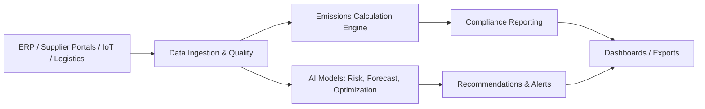

# Phase 1 Submission Answers

## 1. Brief about the Idea
An AI-powered platform that tracks, analyzes, and reduces supply-chain emissions by integrating supplier, logistics, and activity data. It delivers real-time carbon visibility, sustainability scoring, transport optimization, and regulatory reporting across multi-tier supply chains.

## 2. Solution Explanation

### How different is it from any of the other existing ideas?
- Focuses on **multi-tier Scope 3** emissions, not just direct operations.
- Combines **supplier sustainability scoring** with **logistics optimization** in one workflow.
- Provides **audit-ready compliance outputs** (GRI/CSRD/TCFD/CDP) with traceable data lineage.

### How will it be able to solve the problem?
- Ingests ERP, supplier, IoT, and logistics data into a unified emissions model.
- Uses AI to detect emission hotspots, predict risks, and recommend low-carbon alternatives.
- Optimizes routing and sourcing to reduce emissions while respecting cost and delivery constraints.

### USP of the proposed solution
- End-to-end Scope 3 visibility with explainable AI recommendations.
- Combines compliance, optimization, and supplier engagement in one system.
- Decision-ready outputs with quantified emissions and cost trade-offs.

## 3. List of Features Offered by the Solution
- Multi-tier Scope 3 emissions calculation and hotspot analysis
- Supplier sustainability scoring, ranking, and improvement workflows
- Transportation and logistics optimization with emissions impact
- Sustainable sourcing recommendations with trade-off analysis
- Regulatory reporting (GRI, CSRD, TCFD, CDP) with audit trails
- Data quality validation, lineage tracking, and anomaly detection
- Real-time alerts and threshold-based notifications

### Simple Visuals (sketches)
```
[Data Sources] ---> [Ingestion] ---> [AI/ML Models] ---> [Insights/Reports]
     ERP                  |               |                 |
     Supplier Portals      v               v                 v
     Logistics         [Data Lake]    [Optimization]   [Dashboards]
```

## 4. Process Flow Diagram


## 5. Wireframes / Mock Diagrams (Optional)
```
-----------------------------------------------------------
|  Supply Chain Sustainability Dashboard                 |
|  Emissions: 1.2M tCO2e   Trend: -8%     Alerts: 3       |
|---------------------------------------------------------|
|  Hotspots            |  Supplier Scores                |
|  - Region A +24%     |  A: 82  B: 76  C: 61            |
|  - Mode: Air +18%    |  Top Risks: C, F                |
|---------------------------------------------------------|
|  Recommendations     |  Compliance Status              |
|  - Shift Route X     |  CSRD: 72% complete             |
|  - Replace Supplier  |  GRI: 81% complete              |
-----------------------------------------------------------
```

## 6. Architecture Diagram of the Proposed Solution
Use the generated diagram file:
`supply-chain-sustainability/diagrams/architecture.svg` or
`supply-chain-sustainability/diagrams/png/architecture.png`

## 7. Technologies to Be Used in the Solution (AWS-Aligned)
- **Frontend**: React, TypeScript, Tailwind CSS (hosted on S3 + CloudFront)
- **Backend**: FastAPI on AWS Lambda or ECS, API Gateway
- **AI/ML**: Amazon SageMaker (training, endpoints, model registry)
- **Data Processing**: AWS Glue (ETL), AWS Lambda, AWS Kinesis (streaming)
- **Storage**: Amazon S3 (data lake), Amazon RDS/PostgreSQL, Amazon Timestream
- **MLOps**: SageMaker Pipelines, SageMaker Model Registry, CloudWatch
- **Integrations**: AWS IoT Core (MQTT), API Gateway for ERP/logistics APIs
- **Observability**: CloudWatch Logs/Metrics, AWS X-Ray, AWS CloudTrail (audit)
